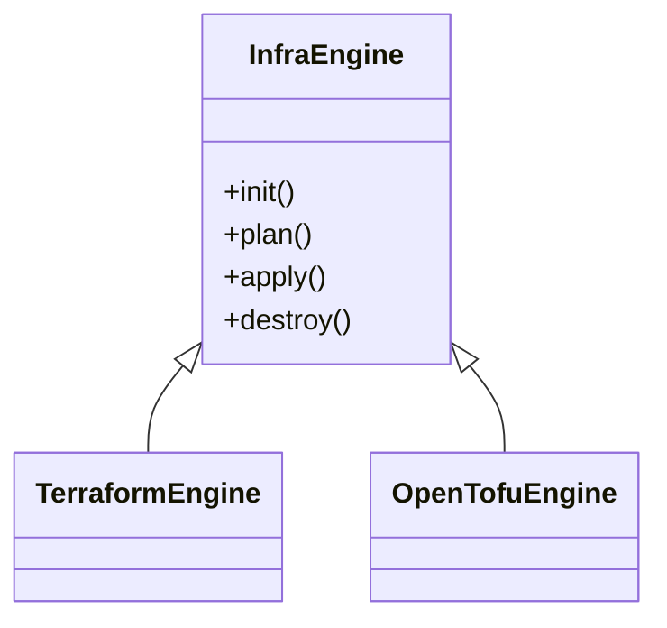
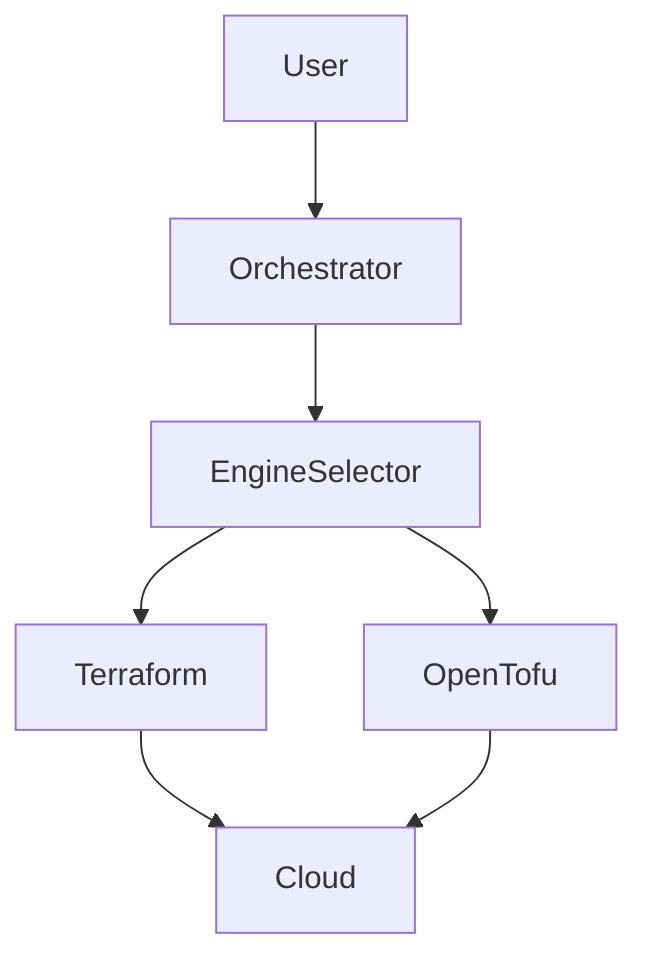
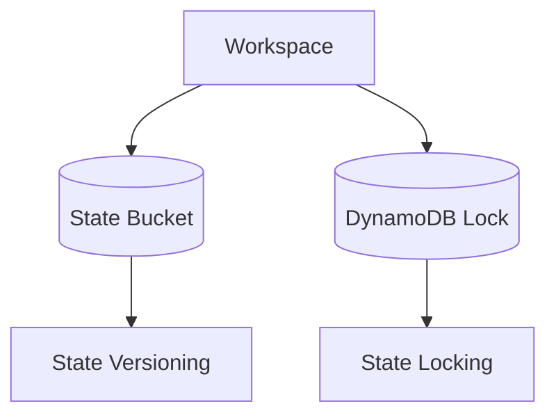
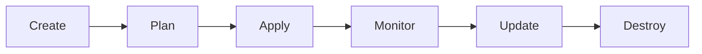
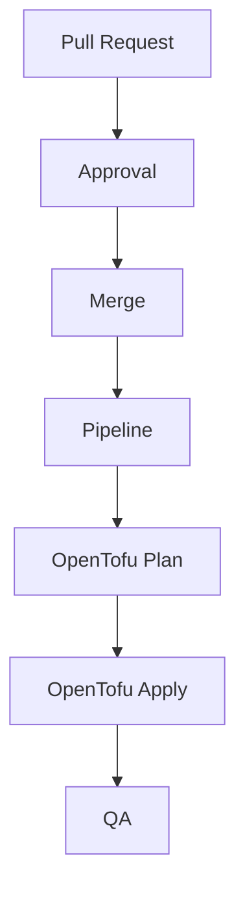

# 🤖 Phase 11.5: OpenTofu, State Management & Enterprise Multi-Tenancy

## Overview
Phase 11.5 introduces OpenTofu support, infrastructure engine abstraction, remote state management, tenant isolation, and enterprise-grade state governance.

## Infrastructure Engine Abstraction



## Execution Flow



## Configuration

```env
INFRA_ENGINE=opentofu
```

or

```env
INFRA_ENGINE=terraform
```

## Remote State Architecture



## Multi-Tenant State Layout

```text
state-bucket/
├── org-a/
│   ├── project-a/
│   │   └── terraform.tfstate
│   └── project-b/
└── org-b/
    └── project-c/
```

## State Backend Example

```hcl
backend "s3" {
  bucket         = "platform-state"
  key            = "org-id/project-id/terraform.tfstate"
  region         = "us-east-1"
  dynamodb_table = "state-locks"
}
```

## Workspace Lifecycle



## GitOps + OpenTofu



## State Governance

- State versioning enabled
- Encryption at rest
- Tenant isolation
- Workspace locking
- Automated backups

## Production Recommendations

1. Prefer OpenTofu for SaaS deployments.
2. Keep Terraform support optional.
3. Use S3 + DynamoDB locking.
4. Separate state per organization.
5. Enforce RBAC around state operations.
6. Audit all state changes.

## Outcome

The platform evolves into an enterprise-ready OpenTofu/Terraform multi-tenant GitOps infrastructure platform.
