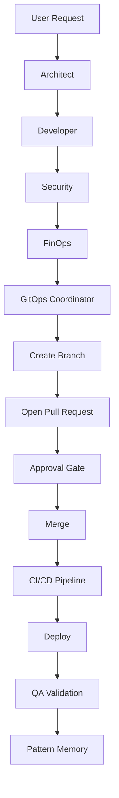
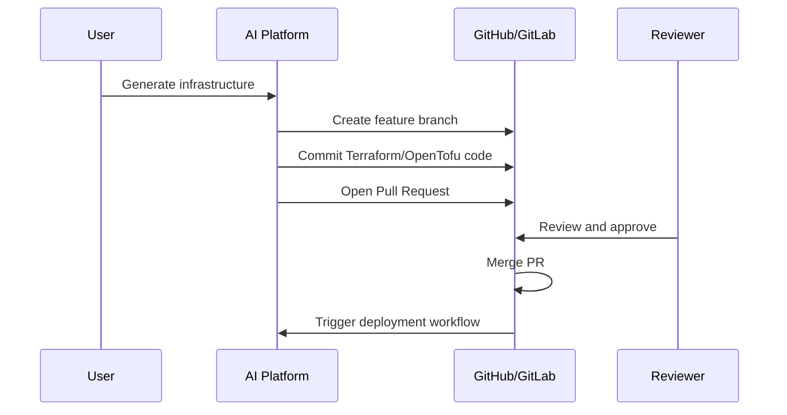
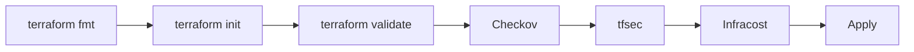
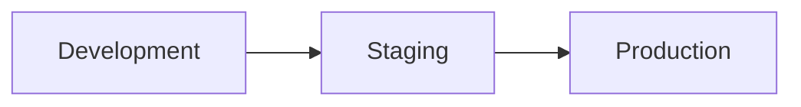
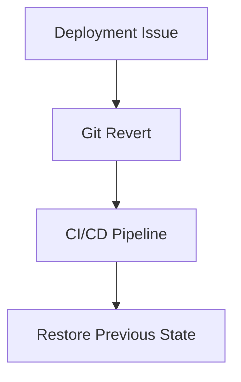

# 🤖 Phase 11: Enterprise GitOps & Controlled Deployments

## Overview
Phase 11 introduces GitOps as the default enterprise deployment workflow.



## GitOps Workflow

### 1. Generate Infrastructure
- Architect designs
- Developer generates code
- Security audits
- FinOps estimates cost

### 2. Git Operations



## GitOps Coordinator Agent

Responsibilities:
- Create branches
- Commit generated IaC
- Create PR/MR
- Monitor CI/CD status
- Report deployment status

## Branch Strategy

```text
main
 └── ai/project-slug-timestamp
```

## CI/CD Validation Pipeline



## RBAC Approval Matrix

- Owner: Full access
- Admin: Approve & Merge
- Member: Create infrastructure
- Viewer: Read only

## Environment Promotion



## Rollback Strategy



## Outcome

AI → Generate → Review → Approve → Merge → Deploy → Validate → Learn
