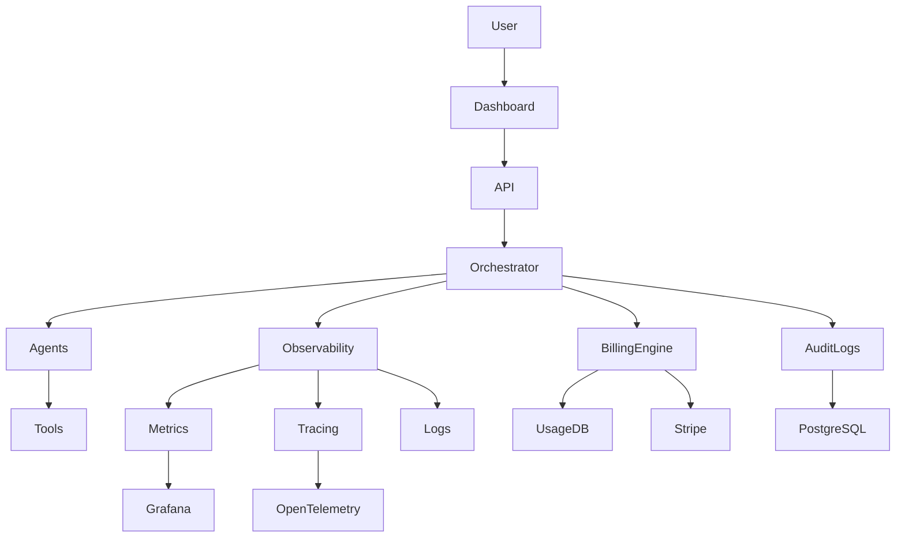
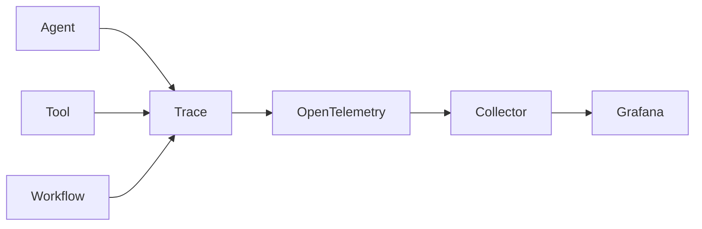
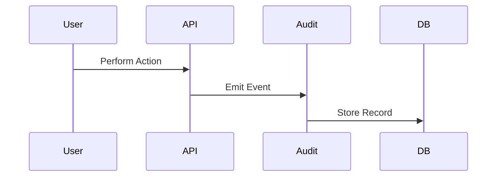
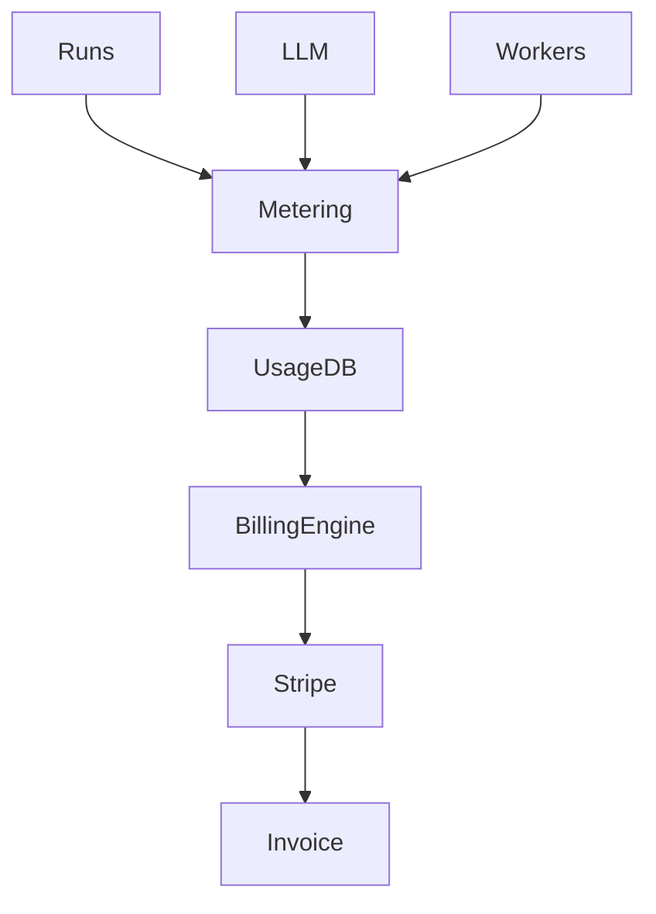
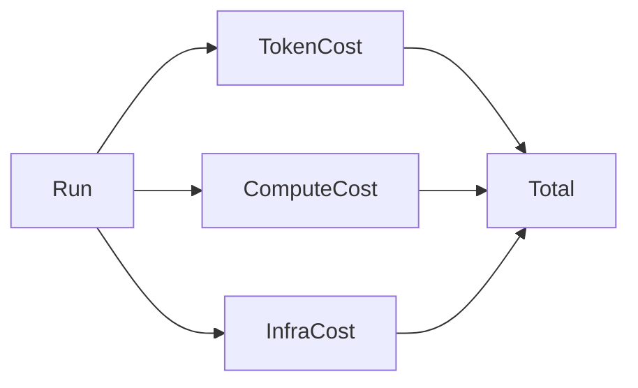
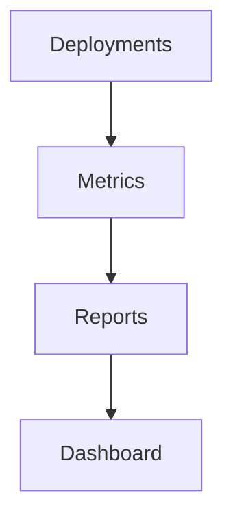

# 🤖 Phase 12: Enterprise Observability, Audit Trail & Billing Platform

## 🎯 Overview

Phase 12 transforms the platform into a fully observable, auditable, and monetizable SaaS offering.

Key goals:

- OpenTelemetry observability
- Agent decision tracing
- Organization-level audit trails
- Usage metering
- Cost attribution
- Billing and subscriptions
- Deployment analytics
- Pattern memory confidence scoring
- Executive dashboards

---

# 🏗️ Phase 12 Architecture



---

# 📊 Observability Layer

## Objectives

Track:

- Agent execution
- Tool usage
- Deployment success rates
- FinOps accuracy
- Retry counts
- Cost per deployment

## Architecture



---

# 🔍 Agent Decision Tracing

Every important decision is recorded.

Example:

```json
{
  "agent": "Developer",
  "decision": "Used Reflection Engine",
  "reason": "Unknown provider error",
  "timestamp": "2026-08-20T12:00:00Z"
}
```

---

# 📜 Audit Trail System

## Audit Events

- Login
- Organization creation
- Project generation
- Pull request creation
- Deployment approval
- Apply
- Destroy
- Rollback



---

# 🏢 Audit Schema

```sql
CREATE TABLE audit_logs (
    id UUID,
    user_id UUID,
    org_id UUID,
    action TEXT,
    resource TEXT,
    timestamp TIMESTAMP
);
```

---

# 💳 Billing Platform

## Billing Sources

### AI Usage

- Prompt tokens
- Completion tokens
- Model usage

### Platform Usage

- Job execution time
- Worker consumption
- Storage

### Infrastructure Usage

- Infracost estimates
- Cloud spend tracking

---

# 💰 Billing Architecture



---

# 📈 Subscription Plans

## Free

- 5 runs/month
- Personal workspace
- Basic observability

## Pro

- Unlimited projects
- GitOps
- Self-healing
- Pattern learning

## Enterprise

- Organizations
- RBAC
- Audit logs
- SSO
- Custom policies
- Dedicated worker pool

---

# 📊 Cost Attribution

Every run receives cost attribution.



---

# 🧠 Pattern Intelligence Analytics

## Confidence Scoring

Each learned pattern stores:

```json
{
  "signature": "BucketAlreadyExists",
  "confidence": 0.92,
  "success_count": 18,
  "last_used": "2026-08-20"
}
```

---

# 📉 Deployment Analytics

Track:

- Success rate
- Failure rate
- Top failure categories
- Average retries
- Average deployment duration



---

# 👀 Executive Dashboard

Widgets:

- Monthly spend
- Active deployments
- Security findings
- Cost savings
- Success trend
- Team activity

---

# 🔐 Compliance Features

Supports:

- SOC2 evidence collection
- Audit exports
- Deployment history
- Approval history
- User access history

---

# 🧱 New Project Structure

```text
observability/
├── tracing.py
├── metrics.py
├── logging.py
├── audit.py
└── dashboards.py

billing/
├── metering.py
├── usage_tracking.py
├── stripe_service.py
└── invoicing.py
```

---

# 🚀 Phase 12 Outcome

The platform evolves from:

```text
AI Infrastructure Platform
```

into:

```text
Enterprise AI Infrastructure Platform
+ Observability
+ Auditability
+ Usage Metering
+ Billing
+ Analytics
```

This creates a production-ready SaaS foundation suitable for organizations and enterprise customers.
