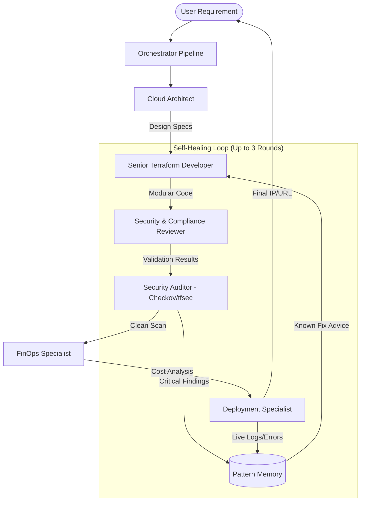

# 🤖 Multi-Agent Terraform Orchestration System (Phase 8)

This document provides a deep dive into the **Phase 8 Multi-Agent Architecture** of the Terraform AI Agent. This system has evolved from a simple code generator into a full-lifecycle **Orchestrated Self-Healing Deployment Platform** with pattern-based failure intelligence.

---

## 🏗️ The Multi-Agent Workflow

The system uses a sequential and iterative process to ensure production-grade infrastructure code. A central **Orchestrator** (`orchestrator/pipeline.py`) manages the entire lifecycle, while a **Failure Pattern Memory** (`memory/`) provides known-fix guidance to accelerate self-healing.



---

## 🧱 Core Architecture Layers

### Orchestrator Layer (`orchestrator/`)
The central pipeline engine that coordinates all agents and manages state.

| Module | Purpose |
| :--- | :--- |
| `pipeline.py` | `run_full_pipeline()` — single authoritative entry-point for both CLI and Web Dashboard. Manages the Architect → Developer → Validator → FinOps → Deploy flow. |
| `retry_handler.py` | `RetryContext` class that tracks self-healing rounds, accumulates errors, and enriches them with pattern-based advice. `should_retry()` distinguishes fixable errors from hard stops. |

### Memory Layer (`memory/`)
A failure pattern knowledge base that allows agents to "remember" fixes to common Terraform errors.

| Module | Purpose |
| :--- | :--- |
| `failure_patterns.json` | Catalog of 20+ known error patterns (S3 naming, IAM permissions, dependency errors, syntax issues, provider misconfigs, timeouts) with categorized fix suggestions. |
| `pattern_manager.py` | `PatternManager` class with `match()`, `format_advice()`, and `add_pattern()` for runtime learning. Injected into agent prompts during self-healing retries. |

---

## 🤖 The Agent Team

### 1. Cloud Architect (The Brain)
- **Role**: Translates plain-text business requirements into technical design.
- **Key Output**: Generates a `PROJECT_SLUG`, architecture blueprint, and a **Mermaid.js visual topology**.
- **Context**: Understands multi-cloud strategies (AWS, Azure, GCP) and high-availability patterns.

### 2. Senior Terraform Developer (The Builder)
- **Role**: Implements the architecture into HashiCorp-standard code.
- **Enforcement**: Highly modular structure. Uses `modules/` for VPC, EKS, IAM, etc.
- **Safety**: Uses a `_sanitize_slug` logic to prevent directory nesting and path confusion.
- **Self-Healing**: Receives known-fix guidance from the Pattern Memory when previous rounds failed.

### 3. Security & Compliance Reviewer (The Gatekeeper)
- **Role**: Performs real-time syntax validation and code-level security checks.
- **Tooling**: Uses `terraform init` and `terraform validate` internally via the `TerraformTools` class.
- **Integration**: `build_error_context()` queries the Pattern Memory for known fixes and formats them as guidance for the Developer agent.

### 4. FinOps Specialist (The Accountant)
- **Role**: Analyzes the financial impact of the generated infrastructure.
- **Tooling**: Integrated with **Infracost**.
- **Features**: 
    - Fetches real-world prices for AWS/Azure resources.
    - Compares estimates against the user's `--budget`.
    - Provides specific optimization suggestions.

### 5. Deployment Specialist (The Operator)
- **Role**: Executes the live infrastructure changes and handles provider-level interactions.
- **Tooling**: Uses `terraform plan` and `terraform apply`.
- **Self-Healing Capabilities**: 
    - Captures real-time CLI errors (e.g., `BucketAlreadyExists`, `AMIIDNotFound`).
    - Feeds technical error logs back to the Pattern Memory and Developer for immediate code remediation.
    - Ensures that "hallucinated" infrastructure is corrected against actual cloud state.

---

## 🚀 Advanced Features

### 🛡️ Automated Self-Healing with Pattern Intelligence
The agent doesn't just "fail" on errors — it learns from them:
1. The **Security Auditor** runs a deep scan using **Checkov** and **tfsec**.
2. If critical vulnerabilities are found, the system **automatically snapshots** the best-known version.
3. The **Pattern Manager** is consulted for known fixes matching the error signatures.
4. The Developer agent receives **targeted fix guidance** (not just raw errors) for the next retry.
5. If a fix makes things worse, the orchestrator can **revert** to the best-known state.
6. The `should_retry()` heuristic halts on hard-stop errors (invalid credentials, budget exceeded) instead of wasting retries.

### 📂 Intelligent Modularization
Unlike basic AI generators, this system creates a professional directory structure:
```text
output/prod-eks-cluster/
├── main.tf (Root orchestrator)
├── variables.tf
├── outputs.tf
└── modules/
    ├── vpc/
    ├── eks/
    └── iam/
```

### 🌐 Multi-Provider Failover
The system is designed to handle API outages and rate limits across multiple providers:
- **Google Gemini**: Primary high-context provider.
- **Groq**: Ultra-fast inference for rapid code generation.
- **Mistral AI**: Optimized for complex logic and coding.
- **Ollama**: Local fallback for private/unlimited usage.

### 🖥️ Web Dashboard
A full-featured Flask dashboard at `http://localhost:5000`:
- **User Authentication**: Login/register with session management.
- **Build Tab**: Submit infrastructure requirements with budget, live deploy toggle, and AI model configuration (provider, model name, API key).
- **Workspaces Tab**: View all projects with tabs for Terraform Code, Visual Topology (Mermaid.js), Evolution History (diffs), FinOps Reports, and Deployment Logs.
- **Live Agent Stream**: Real-time log streaming during generation via SSE.
- **Dashboard Metrics**: Total projects, live deployments, monthly cloud spend, and security risk counts.

---

## ⚙️ Configuration & Usage

### 1. Provider Selection
In your `.env` file, you can switch providers instantly using the prefix:
- `DEFAULT_MODEL=gemini/gemini-2.0-flash`
- `DEFAULT_MODEL=groq/llama-3.3-70b-versatile`
- `DEFAULT_MODEL=mistral/mistral-large-latest`

Or override per-request in the Web Dashboard's Advanced AI Model Configuration panel.

### 2. CLI Execution
```powershell
python app/main.py --budget 150 "Requirement description"
python app/main.py --apply --budget 150 "create a private s3 bucket"
python app/main.py --destroy my-project-slug
```

### 3. Web Dashboard
```powershell
python app/dashboard.py
# Open http://localhost:5000
```

### 4. Safety Mechanisms
- **Snapshotting**: Every "best version" is backed up to `output/.backups/`.
- **Slug Sanitization**: Prevents the agent from creating broken nested paths.
- **Budget Guardrails**: The workflow halts and warns if the estimated cost exceeds your specified budget.
- **Hard-Stop Detection**: `should_retry()` prevents wasting retries on credential or budget errors.

---

## 🛠️ Tool Integration Table

| Tool Name | Engine | Purpose |
| :--- | :--- | :--- |
| `Write Terraform File` | Python/OS | Atomic file creation and directory management. |
| `Validate Terraform Code` | Terraform CLI | Real-time syntax and init verification. |
| `Security Audit` | Checkov/tfsec | Deep static analysis (SCA) for 1000+ security policies. |
| `Cost Estimator` | Infracost | Line-item monthly cost breakdown and budget tracking. |
| `Deployment Tools` | Terraform CLI | Execution of Plan/Apply/Destroy with live log capturing. |
| `Backup/Restore` | Python/shutil | Versioning and crash-recovery for generated code. |
| `Pattern Manager` | Python/JSON | Failure pattern matching and known-fix advice injection. |

---

*Last Updated: 2026-05-16*
