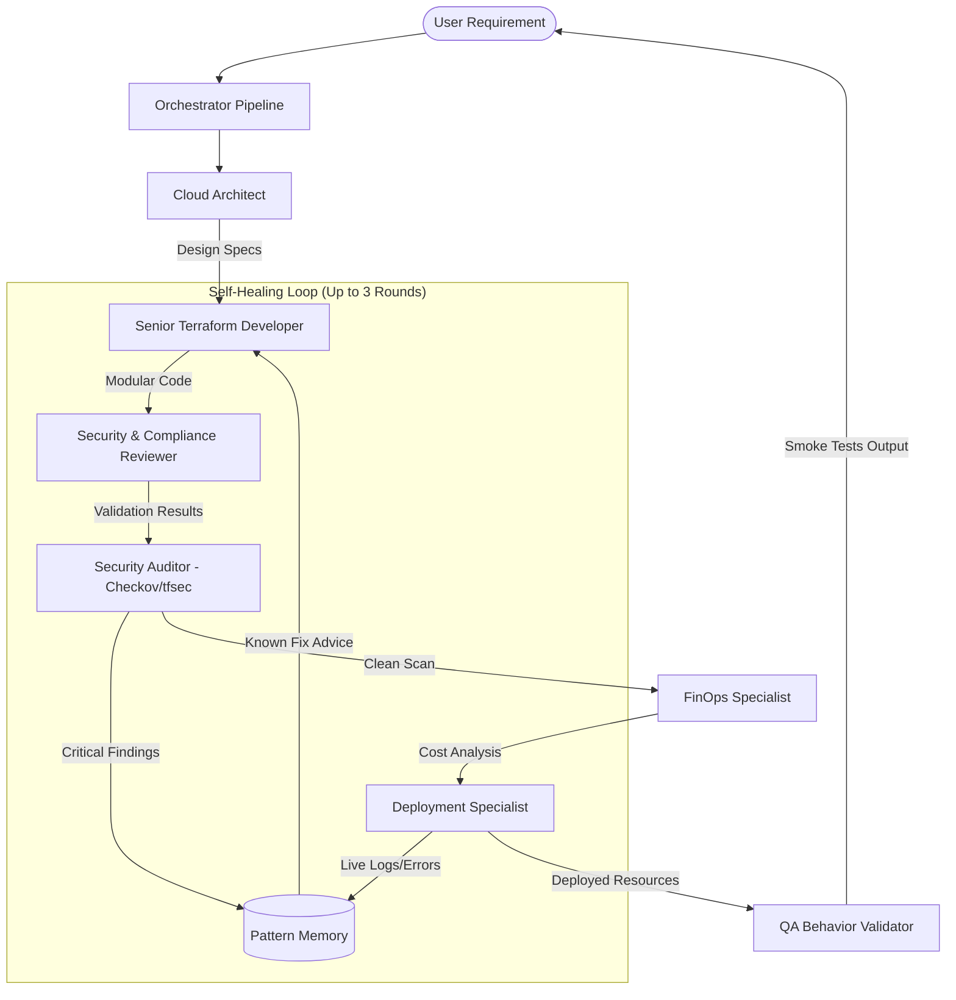

# 🤖 Multi-Agent Terraform Orchestration System (Phase 9)

This document provides a deep dive into the **Phase 9 Multi-Agent Architecture** of the Terraform AI Agent. This system has evolved from a simple code generator into a full-lifecycle **Orchestrated Self-Healing Deployment Platform** with pattern-based failure intelligence, asynchronous execution queues, local cloud emulation, and continuous QA behavior validation.

---

## 🏗️ The Multi-Agent Workflow

The system uses a sequential and iterative process to ensure production-grade infrastructure code. A central **Orchestrator** (`orchestrator/pipeline.py`) manages the entire lifecycle, while an asynchronous task queue (**Celery/Redis**) processes workloads. An LLM-powered **Self-Learning Failure Memory** dynamically learns from resolved runs, and a dedicated **QA Behavior Validator** runs smoke tests against real or emulated cloud backends.



---

## 🧱 Core Architecture Layers

### Orchestrator Layer (`orchestrator/`)
The central pipeline engine that coordinates all agents, manages state, and drives the self-healing loop.

| Module | Purpose |
| :--- | :--- |
| `pipeline.py` | `run_full_pipeline()` — single authoritative entry-point for both CLI and Web Dashboard. Manages the Architect → Developer → Validator → FinOps → Deploy → QA Tester workflow. |
| `retry_handler.py` | `RetryContext` tracks self-healing rounds, accumulates errors, and fetches pattern-based advice. `should_retry()` distinguishes retryable errors from hard stops. |

### Memory Layer (`memory/`)
A failure pattern knowledge base that allows agents to remember fixes to common Terraform errors.

| Module | Purpose |
| :--- | :--- |
| `failure_patterns.json` | Catalog of 20+ known error patterns (S3 naming, IAM permissions, dependency errors, syntax issues, provider misconfigs, timeouts) with categorized fix suggestions. |
| `pattern_manager.py` | `PatternManager` class featuring lookup logic (`match()`, `format_advice()`) and `learn_from_run()` to extract and append new signatures automatically on retry success. |

### Concurrency Queue Layer (`workers/` & `redis`)
Ensures scalability under heavy loads by offloading blocking agent work to a job queue.

| Module | Purpose |
| :--- | :--- |
| `celery_worker.py` | Celery app task wrapper (`run_agent_pipeline_task`) executing main script subprocesses asynchronously and streaming live console output line-by-line to Redis. |
| `redis` | Broker database holding the active task registry and the `logs:active-run` logs. |

---

## 🤖 The Agent Team

### 1. Cloud Architect (The Brain)
- **Role**: Translates plain-text business requirements into technical design.
- **Key Output**: Generates a `PROJECT_SLUG`, architecture blueprint, and a **Mermaid.js visual topology**.
- **Context**: Understands multi-cloud strategies (AWS, Azure, GCP) and high-availability patterns.

### 2. Senior Terraform Developer (The Builder)
- **Role**: Implements the architecture into HashiCorp-standard code.
- **Enforcement**: Highly modular structure. Uses `modules/` for VPC, EKS, IAM, etc.
- **Safety**: Uses a `_sanitize_slug` logic to prevent directory nesting and path confusion.
- **Self-Healing**: Receives known-fix guidance from the Pattern Memory when previous rounds failed.

### 3. Security & Compliance Reviewer (The Gatekeeper)
- **Role**: Performs real-time syntax validation and code-level security checks.
- **Tooling**: Uses `terraform init` and `terraform validate` internally via the `TerraformTools` class.
- **Integration**: `build_error_context()` queries the Pattern Memory for known fixes and formats them as guidance for the Developer agent.

### 4. FinOps Specialist (The Accountant)
- **Role**: Analyzes the financial impact of the generated infrastructure.
- **Tooling**: Integrated with **Infracost**. Exposes tools to query costs, output markdown reports, and write dynamic recommendations.

### 5. Deployment Specialist (The Operator)
- **Role**: Executes the live infrastructure changes and handles provider-level interactions.
- **Tooling**: Uses `terraform plan` and `terraform apply`.
- **Self-Healing Capabilities**: Captures real-time CLI errors and feeds technical error logs back to the Pattern Memory and Developer for immediate code remediation.

### 6. QA Behavior Validator (The Tester)
- **Role**: Performs live post-apply behavior verification tests to ensure that deployed resources are actually healthy and reachable.
- **Tooling**: Utilizes `TestingTools` class to probe HTTP endpoints, check S3 bucket read/write operations, and verify AWS resource active states.

---

## 🚀 Advanced Features

### 🛡️ Automated Self-Healing, Dynamic LLM Reflection, and Documentation Search
The agent doesn't just "fail" on errors — it heals and learns from them dynamically:
1. **Auditing & Error Capture**: The system runs static code scans (Checkov/tfsec) and compilation audits (`terraform validate`).
2. **Failure Pattern Lookup**: The `Pattern Manager` is consulted to check if a matching error signature exists in the memory catalog (`failure_patterns.json`) to fetch pre-learned advice.
3. **Dynamic LLM Reflection Fallback (Phase 11)**: If the error is brand new/unseen, the system triggers the **Reflection Engine** (`orchestrator/reflection.py`). It parses the error log to locate the affected source files, extracts the failing code context, and queries the LLM to dynamically generate precise, explanation-backed fix advice.
4. **Autonomous Documentation Search Tool**: To eliminate hallucinations about newer provider features (e.g. `azurerm` v4+ upgrades), both the **Senior Developer Agent** and the **Reflection Engine** are equipped with the **Search Terraform Documentation** tool. When an error is encountered, the Reflection Engine automatically queries search engines to retrieve live provider documentation and injects the results into the reflection prompt, guaranteeing up-to-date syntax recommendations.
5. **Enriched Code Re-generation**: The Developer agent receives targeted fix guidance (containing dynamic reflection advice, error cause, and the corrected HCL template) to guide it during code updates in the next round.
6. **State Crash-Recovery**: If a retry introduces worse errors, the orchestrator reverts the workspace to the last best-known snapshot using the `Restore Workspace` tool.
7. **Self-Learning Loop**: On success, the self-learning coordinator uses the LLM to generalize the root cause and dynamically appends the new signature/resolution as a permanent entry in `failure_patterns.json`.


### ☁️ Local Cloud Emulation (Floci & Floci-AZ)
Supports risk-free testing by redirecting Terraform AWS/Azure providers to local docker emulators:
- **Floci (AWS)**: Listens on port `4566` to emulate S3, EC2, IAM, EKS, DynamoDB, RDS, SQS, Lambda, and more.
- **Floci-AZ (Azure)**: Emulates Resource Groups, Blob Storage, Key Vault, Cosmos DB, and AKS.
- Overrides are dynamically injected into `providers_override.tf` in the root workspace during generation.

### 📂 Intelligent Modularization
Unlike basic AI generators, this system creates a professional directory structure:
```text
output/prod-eks-cluster/
├── main.tf (Root orchestrator)
├── variables.tf
├── outputs.tf
└── modules/
    ├── vpc/
    ├── eks/
    └── iam/
```

---

## ⚙️ Configuration & Usage

### 1. CLI Execution
```powershell
# For safe planning and auditing
python app/main.py --budget 150 "Requirement description"

# For live deployment (Self-Healing)
python app/main.py --apply --budget 150 "create a private s3 bucket"

# For local emulation mode (using Floci)
python app/main.py --apply --test-local --budget 150 "create a private s3 bucket"

# Destroy infrastructure
python app/main.py --destroy my-project-slug
```

### 2. Web Dashboard
```powershell
python app/dashboard.py
# Open http://localhost:5000
```
- **Asynchronous Execution**: Dispatches generation jobs to Celery workers in the background without blocking FastAPI.
- **Live Agent Stream**: Real-time log streaming from Redis broker using Server-Sent Events (SSE).

---

## 🛠️ Tool Integration Table

| Tool Name | Engine | Purpose |
| :--- | :--- | :--- |
| `Write Terraform File` | Python/OS | Atomic file creation and directory management. |
| `Validate Terraform Code` | Terraform CLI | Real-time syntax and init verification. |
| `Security Audit` | Checkov/tfsec | Deep static analysis (SCA) for 1000+ security policies. |
| `Cost Estimator` | Infracost | Line-item monthly cost breakdown and budget tracking. |
| `Append Optimization Recommendations` | Python/LLM | Writes dynamic optimization advice directly to the report. |
| `Deployment Tools` | Terraform CLI | Execution of Plan/Apply/Destroy with live log capturing. |
| `Backup/Restore` | Python/shutil | Versioning and crash-recovery for generated code. |
| `Pattern Manager` | Python/JSON/LLM | Failure pattern matching, fix guidance, and self-learning loop. |
| `Search Terraform Documentation` | Python/Requests | Online documentation lookup and error resolution search. |
| `HTTP Endpoint Verification` | Python/requests | QA smoke testing of provisioned API/web URLs. |
| `AWS S3 Bucket Verification` | Python/boto3 | QA read/write/delete verification on deployed S3 buckets. |
| `AWS Resource Exists Verification` | Python/boto3 | QA validation of DynamoDB, SQS, EC2, Lambda, or RDS active states. |

---

*Last Updated: 2026-05-24*
