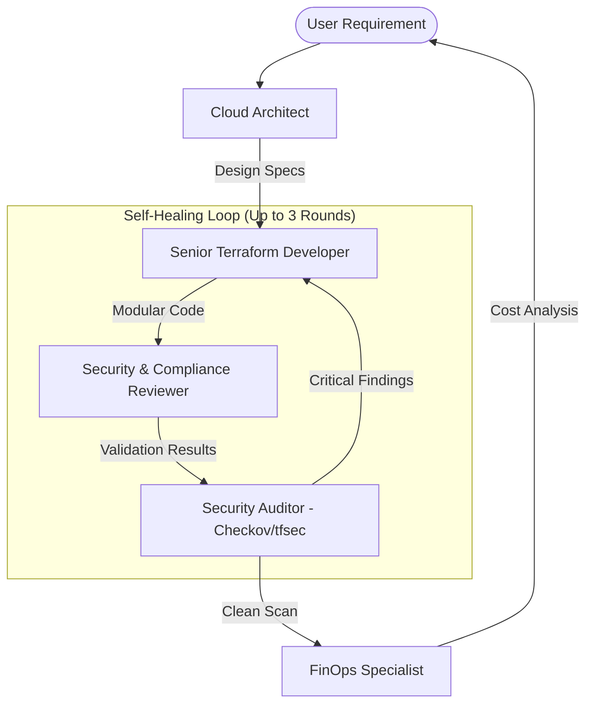

# 🤖 Multi-Agent Terraform Orchestration System

This document provides a deep dive into the **Phase 4 Multi-Agent Architecture** of the Terraform AI Agent. This system transitions from a simple single-prompt generator to a complex, self-correcting assembly line of specialized AI agents.

---

## 🏗️ The Multi-Agent Workflow

The system uses a sequential and iterative process to ensure production-grade infrastructure code.



### 1. Cloud Architect (The Brain)
- **Role**: Translates plain-text business requirements into technical design.
- **Key Output**: Generates a `PROJECT_SLUG` and a detailed architecture blueprint.
- **Context**: Understands multi-cloud strategies (AWS, Azure, GCP) and high-availability patterns.

### 2. Senior Terraform Developer (The Builder)
- **Role**: Implements the architecture into HashiCorp-standard code.
- **Enforcement**: Highly modular structure. Uses `modules/` for VPC, EKS, IAM, etc.
- **Safety**: Uses a `_sanitize_slug` logic to prevent directory nesting and path confusion.

### 3. Security & Compliance Reviewer (The Gatekeeper)
- **Role**: Performs real-time syntax validation and code-level security checks.
- **Tooling**: Uses `terraform init` and `terraform validate` internally via the `TerraformTools` class.
- **Interaction**: If syntax fails, it provides the exact error log back to the Developer for an immediate fix.

### 4. FinOps Specialist (The Accountant)
- **Role**: Analyzes the financial impact of the generated infrastructure.
- **Tooling**: Integrated with **Infracost**.
- **Features**: 
    - Fetches real-world prices for AWS/Azure resources.
    - Compares estimates against the user's `--budget`.
    - Provides specific optimization suggestions (e.g., using Spot instances or ARM-based Graviton CPUs).

---

## 🚀 Advanced Features

### 🛡️ Automated Self-Healing
The agent doesn't just "fail" on errors. 
1. The **Security Auditor** runs a deep scan using **Checkov** and **tfsec**.
2. If critical vulnerabilities are found, the system **automatically snapshots** the best-known version.
3. It then prompts the Developer agent with the security findings to attempt a fix.
4. If a fix makes things worse, it can **revert** to the best-known state.

### 📂 Intelligent Modularization
Unlike basic AI generators, this system creates a professional directory structure:
```text
output/prod-eks-cluster/
├── main.tf (Root orchestrator)
├── variables.tf
├── outputs.tf
└── modules/
    ├── vpc/
    ├── eks/
    └── iam/
```

### 🌐 Multi-Provider Failover
The system is designed to handle API outages and rate limits across multiple providers:
- **Google Gemini**: Primary high-context provider.
- **Groq**: Ultra-fast inference for rapid code generation.
- **Mistral AI**: Optimized for complex logic and coding.
- **Ollama**: Local fallback for private/unlimited usage.

---

## ⚙️ Configuration & Usage

### 1. Provider Selection
In your `.env` file, you can switch providers instantly using the prefix:
- `DEFAULT_MODEL=gemini/gemini-2.0-flash`
- `DEFAULT_MODEL=groq/llama-3.3-70b-versatile`
- `DEFAULT_MODEL=mistral/codestral-latest`

### 2. Execution Command
```powershell
python crew_runner.py --budget 150 "Requirement description"
```

### 3. Safety Mechanisms
- **Snapshotting**: Every "best version" is backed up to `output/.backups/`.
- **Slug Sanitization**: Prevents the agent from creating broken nested paths.
- **Budget Guardrails**: The workflow halts and warns if the estimated cost exceeds your specified budget.

---

## 🛠️ Tool Integration Table

| Tool Name | Engine | Purpose |
| :--- | :--- | :--- |
| `Write Terraform File` | Python/OS | Atomic file creation and directory management. |
| `Validate Terraform Code` | Terraform CLI | Real-time syntax and init verification. |
| `Security Audit` | Checkov (Docker) | Deep static analysis (SCA) for 1000+ security policies. |
| `Cost Estimator` | Infracost | Line-item monthly cost breakdown and budget tracking. |
| `Backup/Restore` | Python/shutil | Versioning and crash-recovery for generated code. |

---

*Last Updated: 2026-04-22*
