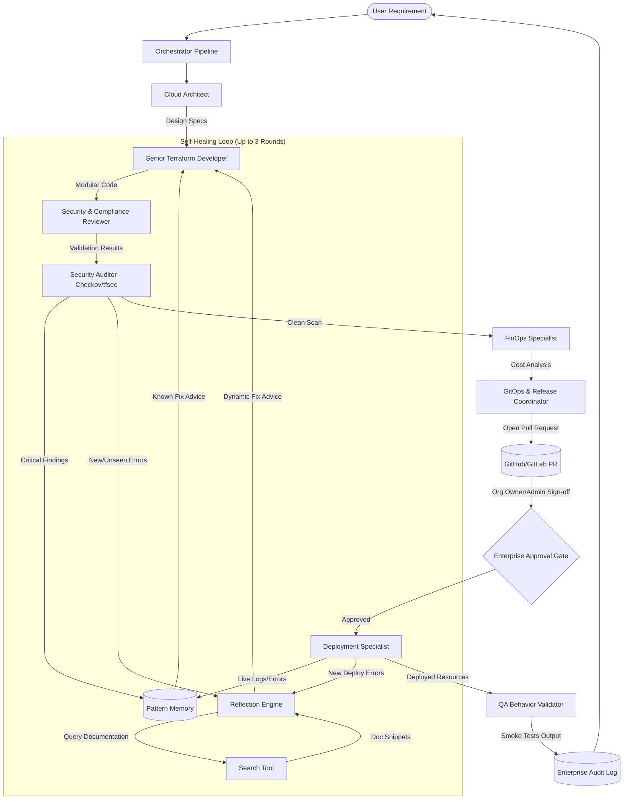

# 🤖 Multi-Agent Terraform Orchestration System (Phase 11: Enterprise GitOps)

This document provides a deep dive into the **Phase 11 Multi-Agent Architecture** of the Terraform AI Agent. This system has evolved from a simple code generator into a full-lifecycle **Orchestrated Self-Healing Deployment Platform** with multi-tenant organization workspaces, enterprise GitOps pull request automation, team approval gates, immutable audit trails, pattern-based failure intelligence, asynchronous execution queues, local cloud emulation, and continuous QA behavior validation.

---

## 🏗️ The Multi-Agent Workflow

The system uses a sequential and iterative process to ensure production-grade infrastructure code. A central **Orchestrator** (`orchestrator/pipeline.py`) manages the entire lifecycle, while an asynchronous task queue (**Celery/Redis**) processes workloads. An LLM-powered **Self-Learning Failure Memory** dynamically learns from resolved runs, and a dedicated **GitOps Coordinator** synthesizes Pull Requests before deployment.


```mermaid
graph TD
    User([User Requirement]) --> Orchestrator[Orchestrator Pipeline]
    Orchestrator --> Architect[Cloud Architect]
    Architect -->|Design Specs| Developer[Senior Terraform Developer]
    Developer -->|Modular Code| Reviewer[Security & Compliance Reviewer]
    Reviewer -->|Validation Results| Auditor[Security Auditor - Checkov/tfsec]
    Auditor -->|Critical Findings| Memory[(Pattern Memory)]
    Memory -->|Known Fix Advice| Developer
    
    Auditor -->|New/Unseen Errors| Reflection[Reflection Engine]
    Reflection -->|Query Documentation| Search[Search Tool]
    Search -->|Doc Snippets| Reflection
    Reflection -->|Dynamic Fix Advice| Developer
    
    Auditor -->|Clean Scan| FinOps[FinOps Specialist]
    FinOps -->|Cost Analysis| GitOps[GitOps & Release Coordinator]
    GitOps -->|Open Pull Request| GitHub[(GitHub/GitLab PR)]
    GitHub -->|Org Owner/Admin Sign-off| ApprovalGate{Enterprise Approval Gate}
    ApprovalGate -->|Approved| Deployer[Deployment Specialist]
    Deployer -->|Live Logs/Errors| Memory
    Deployer -->|New Deploy Errors| Reflection
    Deployer -->|Deployed Resources| QATester[QA Behavior Validator]
    QATester -->|Smoke Tests Output| AuditTrail[(Enterprise Audit Log)]
    AuditTrail --> User
    
    subgraph "Self-Healing Loop (Up to 3 Rounds)"
    Developer
    Reviewer
    Auditor
    Memory
    Reflection
    Search
    Deployer
    end
```

---

## 🧱 Core Architecture Layers

### Observability Layer (`observability/`)
Distributed OpenTelemetry tracing, real-time Prometheus metrics collection, and executive failure taxonomy analytics.

| Module | Purpose |
| :--- | :--- |
| `tracing.py` | `OpenTelemetryTracer` and `Span` managing in-memory trace buffers, span attributes, events, and execution timelines. |
| `metrics.py` | `MetricsCollector` providing Prometheus exposition format, counters, gauges, duration histograms, and JSON metric summaries. |
| `analytics.py` | `AnalyticsEngine` computing executive KPIs (success rates, cost savings, hours saved), failure taxonomy categorizer, and pattern memory leaderboard. |

### Policy-as-Code & Governance Layer (`policy/`) *(Phase 13)*
Open Policy Agent (OPA/Rego) evaluator with pre-packaged enterprise compliance rulepacks and organization guardrails.

| Module | Purpose |
| :--- | :--- |
| `opa_engine.py` | `OPAEngine` evaluating HCL AST against Rego compliance packs (SOC2, HIPAA, PCI-DSS, CIS Benchmarks). |
| `guardrails.py` | `EnterpriseGuardrails` enforcing region whitelisting, budget limits, prohibited services, and mandatory tags. |
| `compliance/*.rego`| Pre-packaged Rego rules enforcing encryption at rest, TLS in transit, and least-privilege networking. |

### Enterprise Identity Federation Layer (`sso/`) *(Phase 13)*
OAuth2/OIDC and SAML 2.0 Identity Provider federation for enterprise single sign-on.

| Module | Purpose |
| :--- | :--- |
| `providers.py` | `SSOProviderConfig` defining IdP metadata for Microsoft Entra ID (Azure AD), Okta, Google Workspace, and Auth0. |
| `oidc.py` | `OIDCService` managing authorization code redirects, token validation, and automatic database user provisioning. |
| `saml.py` | `SAMLService` parsing SAML 2.0 XML assertion tokens and claims. |

### Multi-Agent Consensus & Debate Layer (`consensus/`) *(Phase 13)*
Competitive architectural debate and consensus scoring to prevent single-agent hallucinations.

| Module | Purpose |
| :--- | :--- |
| `consensus_scorer.py`| `ConsensusScorer` calculating 4-dimensional weighted scores (Security, Cost, Reliability, Simplicity). |
| `debate_engine.py` | `MultiAgentDebateEngine` orchestrating Developer Agent A (Scale & HA) vs Developer Agent B (Lean Cost) vs Independent Reviewer. |

### Multi-Cloud Architecture Optimization Layer (`cloud_optimizer/`) *(Phase 13)*
Automated cross-cloud synthesis and cost optimization.

| Module | Purpose |
| :--- | :--- |
| `provider_comparator.py` | `ProviderComparator` mapping equivalent services and pricing across AWS, Azure, and GCP. |
| `multi_cloud.py` | `MultiCloudOptimizer` evaluating requirements against AWS, Azure, and GCP to recommend the optimal cloud provider. |

### AI Operations Center Layer (`aiops/`) *(Phase 13)*
Real-time AIOps monitoring, incident alerting, and dynamic LLM routing.

| Module | Purpose |
| :--- | :--- |
| `monitoring.py` | `AIOpsMonitor` aggregating agent health, failure rates, pattern learning speed, and execution trends. |
| `alerts.py` | `AIOpsAlertManager` tracking active budget overages, cloud drift incidents, and unhealed retry alerts. |
| `model_router.py` | `IntelligentModelRouter` dynamically routing tasks to fast/cost-effective or frontier reasoning models based on complexity. |

### Usage Metering & Billing Layer (`billing/`)
Multi-dimensional consumption metering, tier quota management, and Stripe subscription service.

| Module | Purpose |
| :--- | :--- |
| `metering.py` | `UsageMeter` estimating prompt/completion tokens, pricing per LLM model, compute worker duration cost, and 3-way cost attribution. |
| `usage_tracking.py` | `BillingTracker`, `UsageRecordModel`, and `SubscriptionModel` managing monthly run quotas, usage persistence, and account tier upgrades. |
| `stripe_service.py` | `StripeBillingService` defining Free, Pro, and Enterprise tiers with mock and live Stripe checkout session integration. |
| `razorpay_service.py` | `RazorpayBillingService` handling Indian Rupee (INR), UPI, NetBanking, and credit/debit card orders. |
| `invoicing.py` | `InvoiceGenerator` synthesizing cost attribution statements and monthly invoice summaries. |

### IaC Engine Abstraction Layer (`tools/engine/`)
Universal runtime abstraction layer supporting both HashiCorp Terraform and Linux Foundation OpenTofu.

| Module | Purpose |
| :--- | :--- |
| `base.py` | `IaCEngine` abstract base class defining standard operations (`fmt`, `init`, `validate`, `plan`, `apply`, `destroy`, `show_state`, `get_version`, `is_available`). |
| `terraform_engine.py` | `TerraformEngine` implementing CLI operations using the `terraform` binary. |
| `opentofu_engine.py` | `OpenTofuEngine` implementing CLI operations using the `tofu` binary. |
| `factory.py` | `EngineFactory` managing engine resolution (`get_engine()`), environment checks, and automatic fallback when a binary is not present on PATH. |

### GitOps & Release Layer (`tools/gitops/` & `agents/gitops_coordinator.py`)
Deterministic Git operations, pull request synthesis, and GitHub REST API integration.

| Module | Purpose |
| :--- | :--- |
| `gitops_tools.py` | `GitOpsTools` provides branch creation (`ai/{slug}-{timestamp}`), atomic commit staging, remote push, Markdown PR body generation (with Mermaid diagram, Infracost table, and Checkov findings), GitHub PR creation, and automated squash merging. |
| `gitops_coordinator.py` | `GitOpsCoordinator` agent reviews generated IaC and prepares release metadata for repository pull requests. |

### Enterprise Audit Trail Layer (`tools/project/`)
Immutable audit log tracking all actions across multi-tenant organizations.

| Module | Purpose |
| :--- | :--- |
| `tracker.py` — `AuditTracker` | Immutable activity logging (`log_action()`, `get_logs()`) for `gitops_pr_created`, `gitops_pr_approved`, `gitops_pr_merged_and_deployed`, and organization memberships. |
| `tracker.py` — `OrgTracker` | Organization CRUD: create orgs with auto-slugging, list user memberships, add/remove members with roles (owner/admin/member/viewer), check RBAC permissions. |
| `tracker.py` — `ProjectTracker` | SQL-backed project metadata with `org_id` scoping and GitOps columns (`git_repo`, `git_branch`, `pr_url`, `pr_number`, `pr_status`, `approval_status`, `approved_by_id`). |
| `tracker.py` — `UserTracker` | User registration, password hashing (Werkzeug), and session-based authentication. |

### Concurrency Queue Layer (`workers/` & `redis`)
Ensures scalability under heavy loads by offloading blocking agent work to a job queue.

| Module | Purpose |
| :--- | :--- |
| `celery_worker.py` | Celery app task wrapper (`run_agent_pipeline_task`) executing main script subprocesses asynchronously and streaming live console output line-by-line to Redis. Supports GitOps flags. |
| `redis` | Broker database holding the active task registry and the `logs:active-run` logs. |

---

## 🤖 The Agent Team

### 1. Cloud Architect (The Brain)
- **Role**: Translates plain-text business requirements into technical design.
- **Key Output**: Generates a `PROJECT_SLUG`, architecture blueprint, and a **Mermaid.js visual topology**.
- **Context**: Understands multi-cloud strategies (AWS, Azure, GCP) and high-availability patterns.

### 2. Senior Terraform Developer (The Builder)
- **Role**: Implements the architecture into HashiCorp-standard code.
- **Enforcement**: Highly modular structure. Uses `modules/` for VPC, EKS, IAM, etc.
- **Safety**: Uses a `_sanitize_slug` logic to prevent directory nesting and path confusion.
- **Self-Healing**: Receives known-fix guidance from the Pattern Memory when previous rounds failed.

### 3. Security & Compliance Reviewer (The Gatekeeper)
- **Role**: Performs real-time syntax validation and code-level security checks.
- **Tooling**: Uses `terraform init` and `terraform validate` internally via the `TerraformTools` class.
- **Integration**: `build_error_context()` queries the Pattern Memory for known fixes and formats them as guidance for the Developer agent.

### 4. FinOps Specialist (The Accountant)
- **Role**: Analyzes the financial impact of the generated infrastructure.
- **Tooling**: Integrated with **Infracost**. Exposes tools to query costs, output markdown reports, and write dynamic recommendations.

### 5. GitOps & Release Coordinator (The Release Engineer)
- **Role**: Manages version control, branch staging, and Pull Request synthesis.
- **Tooling**: Uses `GitOpsTools` to create isolated feature branches, stage all `.tf` files, push to remote repos, and open formatted PRs on GitHub.

### 6. Deployment Specialist (The Operator)
- **Role**: Executes live infrastructure changes once PR is approved.
- **Tooling**: Uses `terraform plan` and `terraform apply`.
- **Self-Healing Capabilities**: Captures real-time CLI errors and feeds technical error logs back to the Pattern Memory and Developer for immediate code remediation.

### 7. QA Behavior Validator (The Tester)
- **Role**: Performs live post-apply behavior verification tests to ensure that deployed resources are actually healthy and reachable.
- **Tooling**: Utilizes `TestingTools` class to probe HTTP endpoints, check S3 bucket read/write operations, and verify AWS resource active states.

---

## 🚀 Advanced Features

### 🛡️ Automated Self-Healing, Dynamic LLM Reflection, and Documentation Search
The agent doesn't just "fail" on errors — it heals and learns from them dynamically:
1. **Auditing & Error Capture**: The system runs static code scans (Checkov/tfsec) and compilation audits (`terraform validate`).
2. **Failure Pattern Lookup**: The `Pattern Manager` is consulted to check if a matching error signature exists in the memory catalog (`failure_patterns.json`) to fetch pre-learned advice.
3. **Dynamic LLM Reflection Fallback (Phase 11)**: If the error is brand new/unseen, the system triggers the **Reflection Engine** (`orchestrator/reflection.py`). It parses the error log to locate the affected source files, extracts the failing code context, and queries the LLM to dynamically generate precise, explanation-backed fix advice.
4. **Autonomous Documentation Search Tool**: To eliminate hallucinations about newer provider features (e.g. `azurerm` v4+ upgrades), both the **Senior Developer Agent** and the **Reflection Engine** are equipped with the **Search Terraform Documentation** tool. When an error is encountered, the Reflection Engine automatically queries search engines to retrieve live provider documentation and injects the results into the reflection prompt, guaranteeing up-to-date syntax recommendations.
5. **Enriched Code Re-generation**: The Developer agent receives targeted fix guidance (containing dynamic reflection advice, error cause, and the corrected HCL template) to guide it during code updates in the next round.
6. **State Crash-Recovery**: If a retry introduces worse errors, the orchestrator reverts the workspace to the last best-known snapshot using the `Restore Workspace` tool.
7. **Self-Learning Loop**: On success, the self-learning coordinator uses the LLM to generalize the root cause and dynamically appends the new signature/resolution as a permanent entry in `failure_patterns.json`.


### ☁️ Local Cloud Emulation (Floci & Floci-AZ)
Supports risk-free testing by redirecting Terraform AWS/Azure providers to local docker emulators:
- **Floci (AWS)**: Listens on port `4566` to emulate S3, EC2, IAM, EKS, DynamoDB, RDS, SQS, Lambda, and more.
- **Floci-AZ (Azure)**: Emulates Resource Groups, Blob Storage, Key Vault, Cosmos DB, and AKS.
- Overrides are dynamically injected into `providers_override.tf` in the root workspace during generation.

### 📂 Intelligent Modularization
Unlike basic AI generators, this system creates a professional directory structure:
```text
output/prod-eks-cluster/
├── main.tf (Root orchestrator)
├── variables.tf
├── outputs.tf
└── modules/
    ├── vpc/
    ├── eks/
    └── iam/
```

---

## ⚙️ Configuration & Usage

### 1. CLI Execution
```powershell
# For safe planning and auditing
python app/main.py --budget 150 "Requirement description"

# For live deployment (Self-Healing)
python app/main.py --apply --budget 150 "create a private s3 bucket"

# For local emulation mode (using Floci)
python app/main.py --apply --test-local --budget 150 "create a private s3 bucket"

# Destroy infrastructure
python app/main.py --destroy my-project-slug
```

### 2. Web Dashboard
```powershell
python app/dashboard.py
# Open http://localhost:5000
```
- **Asynchronous Execution**: Dispatches generation jobs to Celery workers in the background without blocking FastAPI.
- **Live Agent Stream**: Real-time log streaming from Redis broker using Server-Sent Events (SSE).
- **Organization Workspaces**: Header dropdown to switch between Personal and Organization contexts. Stats, projects, and generation all scope to the active workspace.
- **Team Management**: Modal UI for inviting members by username, assigning roles (Admin/Member/Viewer), and removing team members. RBAC enforced server-side.

---

## 🛠️ Tool Integration Table

| Tool Name | Engine | Purpose |
| :--- | :--- | :--- |
| `Write Terraform File` | Python/OS | Atomic file creation and directory management. |
| `Validate Terraform Code` | Terraform CLI | Real-time syntax and init verification. |
| `Security Audit` | Checkov/tfsec | Deep static analysis (SCA) for 1000+ security policies. |
| `Cost Estimator` | Infracost | Line-item monthly cost breakdown and budget tracking. |
| `Append Optimization Recommendations` | Python/LLM | Writes dynamic optimization advice directly to the report. |
| `Deployment Tools` | Terraform CLI | Execution of Plan/Apply/Destroy with live log capturing. |
| `Backup/Restore` | Python/shutil | Versioning and crash-recovery for generated code. |
| `Pattern Manager` | Python/JSON/LLM | Failure pattern matching, fix guidance, and self-learning loop. |
| `Search Terraform Documentation` | Python/Requests | Online documentation lookup and error resolution search. |
| `HTTP Endpoint Verification` | Python/requests | QA smoke testing of provisioned API/web URLs. |
| `AWS S3 Bucket Verification` | Python/boto3 | QA read/write/delete verification on deployed S3 buckets. |
| `AWS Resource Exists Verification` | Python/boto3 | QA validation of DynamoDB, SQS, EC2, Lambda, or RDS active states. |

---

## 🏢 Organization & RBAC API

| Endpoint | Method | Auth | Purpose |
| :--- | :--- | :--- | :--- |
| `/api/orgs` | GET | User | List all organizations the user belongs to |
| `/api/orgs` | POST | User | Create a new organization (creator becomes Owner) |
| `/api/orgs/{id}/members` | GET | Org Member | List all members and their roles |
| `/api/orgs/{id}/members` | POST | Owner/Admin | Invite a registered user by username with a role |
| `/api/orgs/{id}/members/{uid}` | PUT | Owner/Admin | Update a member's role |
| `/api/orgs/{id}/members/{uid}` | DELETE | Owner/Admin | Remove a member from the organization |
| `/api/projects?org_id=X` | GET | Org Member | List projects scoped to the organization |
| `/api/stats?org_id=X` | GET | Org Member | Get dashboard metrics for the organization |
| `/api/generate` | POST (with `org_id`) | Non-Viewer | Generate infrastructure in an organization context |

---

*Last Updated: 2026-08-05*
