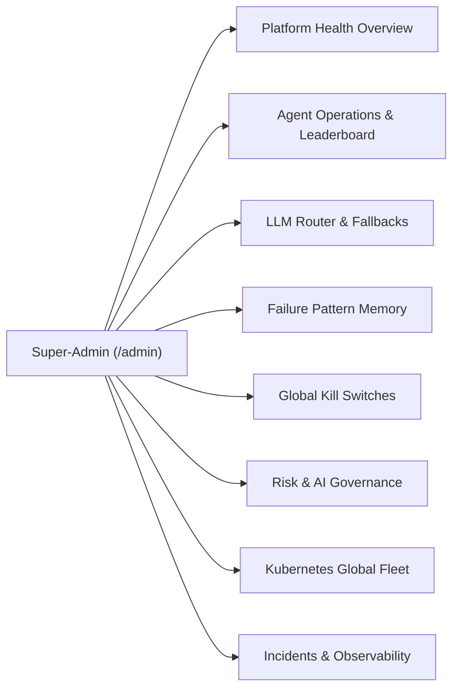

# 🤖 Autonomous Platform Engineering Ecosystem & Kubernetes Control Plane (Phases 1 – 15)

An enterprise-grade Autonomous Platform Engineering Ecosystem and Kubernetes-Native Infrastructure Control Plane powered by **HashiCorp Terraform** and **Linux Foundation OpenTofu**. Built for modern engineering organizations with a **Kubernetes CRD Operator & GitOps Controllers (ArgoCD & Flux)**, **Agent Marketplace & Plugin SDK**, **Visual DAG Workflow Builder**, **Golden Path Service Catalog**, **FinOps Right-Sizing & Autonomous Remediation**, **Multi-Region Disaster Recovery (DR) & Automated Regional Failover**, **Policy-as-Code (OPA / Rego)**, **Enterprise SSO (OIDC / SAML 2.0)**, **Multi-Agent Consensus & Debate**, **Dual Payment Gateways (Razorpay & Stripe)**, **OpenTelemetry Observability**, and **Role-Based Access Control (RBAC)**.

---

## 🚀 Key Features

- **Super-Admin Platform Operations Command Center (`/admin`)**: A comprehensive, production-grade Platform Engineering Operating System command center featuring:
  - **Platform Health Overview & Multi-Tenant Administration**: Real-time cross-tenant aggregation (145+ organizations, active users, running jobs, worker utilization %), database/cache heartbeat monitors (PostgreSQL & Redis connection pools), user lifecycle controls (suspend/reactivate, super-admin privilege escalation), and tenant subscription tier overrides (`Free`, `Pro`, `Enterprise`). Includes CLI bootstrap utility (`scripts/create_admin.py`).
  - **Agent Operations Center & Live Leaderboard (Priority 2)**: Real-time fleet health monitoring for all 7 specialized agents (`ArchitectAgent`, `DeveloperAgent`, `SecurityReviewer`, `FinOpsSpecialist`, `TestingAgent`, `GitOpsCoordinator`, `DeploymentPlanner`). 4-KPI operational leaderboard (Most Used, Highest Failure Rate, Top Token Consumer, Most Expensive Agent), visual stage waterfall traces (`PipelineStageTraceModel`), and in-flight intervention checkpoints (**Pause**, **Resume**, **Cancel**).
  - **LLM Router & Fallback Policy Control Center (Priority 3)**: Microsecond routing governance across 9 AI providers (Gemini, Claude, OpenAI, Groq, Mistral, ZenMux, OpenRouter, NVIDIA, Ollama). Dynamic routing modes (`auto`, `force`, `failover_chain`), 1-click emergency provider isolation toggles with microsecond environment caching, priority-ordered fallback chains, and synthetic diagnostic latency probes.
  - **Dynamic Failure Pattern Memory & ML Confidence Scoring (Priority 4)**: Machine learning-style reinforcement confidence scoring ($0.0 - 1.0$), categorized failure intelligence (`provider`, `syntax`, `iam`, `quota`), and administrative promotion of verified fixes to "Trusted" status.
  - **Global Operational Kill Switches (Priority 6)**: Emergency circuit breakers allowing immediate 1-click halting of cloud deployments, GitOps PR synthesis, self-healing retries, marketplace plugins, or tenant registrations with mandatory administrative audit justifications recorded in `GlobalAuditVault`.
  - **Risk, Security & AI Governance Center (Priorities 7 & 12)**: 12 pre-configured policy guardrails across IAM, Network, Storage Encryption, and Tagging with runtime enforcement toggles (**Blocking**, **Advisory**, **Disabled**). Features live threat alerts ticker, explainable AI consensus decision traces with composite risk scoring (0-100), and an on-demand static HCL/OPA vulnerability scanner.
  - **Kubernetes Global Fleet & Node Control Center (Priority 8)**: Multi-cluster switching (`docker-desktop`, `aws-eks-prod`, `gcp-gke-staging`), live node allocation vitals (CPU Cores, Memory GB, Pod Fleet Density), active workloads pod matrix with replica targets and resource requests, interactive pod stdout/stderr log stream modal, CRD instance monitor, and GitOps cloud drift auto-reconciliation.
  - **Incident Management & In-Cluster Observability Stack (Priority 9)**: Native **Prometheus** (Port 9090), **Grafana** (Port 3000), and **Alertmanager** (Port 9093) integration. Standardized `/metrics` exposition endpoint exporting real-time platform counters, incident triage matrix (`P1`-`P4`), generative AI Root Cause Analysis (RCA), outbound alert webhooks (Slack, PagerDuty, Discord), and inbound Alertmanager webhook receiver.
- **Kubernetes-Native Control Plane & CRD Operator** *(Phase 15)*: Manage AI Terraform agents, multi-tenant projects, DAG workflows, and compliance policies as native Kubernetes Custom Resources (`kubectl apply -f agent.yaml`). Features an asynchronous Operator controller reconciliation loop with condition lifecycle, continuous cloud drift watcher with auto-healing, ArgoCD custom Lua health checks, Flux CD webhook synchronizer, Helm 3 deployment charts, and native dashboard REST endpoints.
- **Agent Marketplace & Plugin SDK** *(Phase 14)*: Organization-scoped agent registry with installable specialist agents (`Kubernetes Specialist`, `FinOps Cost Hawk`, `Disaster Recovery Pilot`, `Zero-Trust SecOps`) and standard `BasePlugin` lifecycle hooks (`pre_plan`, `post_plan`, `validate`).
- **Visual DAG Workflow Builder & Golden Path Catalog** *(Phase 14)*: Node-based visual execution graph engine with dependency resolution, conditional branching, automated rollbacks, and pre-architected Golden Path service templates (*Microservices K8s Stack*, *Serverless Event Stream*, *Secure ML Vault*).
- **FinOps Optimization & Autonomous Remediation** *(Phase 14)*: Continuous cost right-sizing (compute right-sizing, spot workloads, S3 Glacier lifecycle tiering) and automated self-healing remediation that synthesizes, validates via OPA, and auto-applies safe infrastructure patches.
- **Disaster Recovery (DR) & Multi-Region Control Plane** *(Phase 14)*: Automated cross-region state snapshots, RTO/RPO metrics tracking, and one-click regional failover orchestration with DNS cutover simulation.
- **AI Agent Governance & Risk Scoring Framework** *(Phase 14)*: 0-100 composite risk scoring evaluating destructive statements, open ingress, wildcard IAM policies, and cost impact to enforce safe autonomous execution.
- **Policy-as-Code & Compliance Packs** *(Phase 13)*: Built-in Open Policy Agent (**OPA / Rego**) evaluator with pre-packaged enterprise compliance rules: **SOC2 Type II**, **HIPAA**, **PCI-DSS v4.0**, and **CIS Cloud Architecture Benchmarks**.
- **Enterprise Identity Federation & SSO** *(Phase 13)*: Full OAuth2/OIDC and SAML 2.0 authentication support for **Microsoft Entra ID (Azure AD)**, **Okta Enterprise**, **Google Workspace**, and **Auth0** with seamless user auto-provisioning.
- **Multi-Agent Consensus & Debate Engine** *(Phase 13)*: Eliminates single-agent hallucinations through competitive architectural debates between **Developer Agent A** (Enterprise Scale & HA), **Developer Agent B** (Lean Serverless & Cost Economy), and an **Independent Reviewer** scored via a 4-dimensional weighted consensus matrix.
- **Multi-Cloud Optimization Engine** *(Phase 13)*: Side-by-side architectural and pricing synthesis comparing **AWS vs. Azure vs. GCP** for any infrastructure requirement to recommend the optimal cloud provider.
- **AI Operations Center (AIOps) & Model Routing** *(Phase 13)*: Real-time telemetry monitoring agent health, failure taxonomy, pattern learning speed, proactive budget/drift alerting, and task-complexity-based **Intelligent Model Routing**.
- **Vector Knowledge Base & Database Pattern Memory** *(Phase 13)*: Scalable `PatternMemoryModel` backed by PostgreSQL / `pgvector` (with in-memory cosine fallback) and vectorized Terraform/OpenTofu cloud runbooks.
- **Enterprise Observability & OpenTelemetry Tracing** *(Phase 12)*: Distributed tracing (`observability/tracing.py`) tracking agent execution, tool calls, and self-healing cycles. Real-time metrics collector (`observability/metrics.py`) providing Prometheus text exposition and JSON summaries.
- **Multi-Dimensional Usage Metering & Cost Attribution** *(Phase 12)*: Tracks 3-way cost attribution across **AI LLM Tokens** (prompt/completion rates per model), **Platform Compute Duration** (worker execution time), and **Cloud Infrastructure Spend** (Infracost monthly projections).
- **Subscription Plans & Dual Payment Gateways** *(Phase 12)*: Tiered subscription management with **Free Tier** (5 runs/month), **Pro Developer** (100 runs/month, OpenTofu & GitOps), and **Enterprise Team** (unlimited runs, RBAC, approval gates, audit export). Integrated with **Razorpay (UPI/Cards/NetBanking)** and **Stripe**.
- **Pattern Memory Confidence Scoring** *(Phase 12)*: Machine learning-style confidence scoring and reinforcement (`confidence`, `success_count`, `failure_count`, `last_used`) for failure patterns, automatically promoting verified fixes to "trusted" status.
- **Executive Analytics & Compliance Package Export** *(Phase 12)*: High-level KPI widgets (success rate trend, engineering hours saved, cost savings, failure taxonomy breakdown) and one-click **SOC2 Regulatory Compliance Package** export (JSON / CSV).
- **IaC Engine Abstraction Layer & OpenTofu Integration** *(Phase 12)*: Universal runtime abstraction layer supporting both **HashiCorp Terraform** (`terraform`) and **Linux Foundation OpenTofu** (`tofu`). Execute formatting, validation, planning, application, drift detection, and state tracking seamlessly across either engine with automatic discovery and intelligent fallback.
- **Enterprise GitOps & PR Automation** *(Phase 11)*: Automated feature branch creation (`ai/{slug}-{timestamp}`), deterministic file staging, commit generation, and GitHub/GitLab Pull Request synthesis with rich Markdown templates containing visual Mermaid diagrams, Infracost breakdowns, and Checkov security reports.
- **Team Approval Gates & Audit Trails** *(Phase 11)*: Multi-tier approval workflow where Pull Requests require sign-off by Organization Owners or Admins prior to live cloud mutation. Comprehensive immutable audit logging (`AuditTracker`) captures every event (`gitops_pr_created`, `gitops_pr_approved`, `gitops_pr_merged_and_deployed`) across teams.
- **Multi-Tenant Organizations & RBAC** *(Phase 10)*: GitHub-style **multi-organization workspaces** with team collaboration. Create organizations, invite members by username, assign roles (Owner, Admin, Member, Viewer), and seamlessly switch between Personal and Organization contexts. Viewer role is restricted from generating/destroying infrastructure.
- **Multi-Agent Orchestration**: Powered by **CrewAI**, utilizing 7 specialized agents (Architect, Developer, Security Reviewer, FinOps Specialist, Deployment Planner, QA Testing Agent, and GitOps Coordinator) for a robust production pipeline.
- **Central Pipeline Orchestrator**: A dedicated `orchestrator/` module provides a single authoritative entry-point (`run_full_pipeline`) for both the CLI and Web Dashboard, with built-in self-healing retry logic.
- **Asynchronous Job Queue**: Powered by **Celery** and **Redis** to run heavy Terraform generation, deployment, and testing tasks concurrently in the background without blocking the web gateway.
- **Local AWS Emulation**: Integrated **Floci** (a local, high-speed AWS emulator) to test deploy mock resources (S3, EC2, RDS, Lambda, DynamoDB, SQS) completely free of charge.
- **Continuous QA Testing Agent**: A dedicated agent that runs post-apply behavior verification tests (HTTP checks, S3 read/write validations, AWS resource status audits) against emulated or real environments.
- **Failure Pattern Memory & Self-Learning**: When Terraform errors are successfully resolved via retries, the system triggers an LLM self-learning loop to automatically extract the root cause and update `failure_patterns.json` dynamically, continuously expanding its own knowledge bank.
- **Universal LLM Support**: Powered by **LiteLLM**, allowing you to swap between 100+ providers (Gemini, Groq, Mistral, OpenAI, ZenMux) via a single `.env` setting or the Web UI.
- **Web Dashboard**: Full-featured FastAPI dashboard with user authentication, organization management, project isolation, live agent log streaming, visual topology (Mermaid.js), FinOps reports, and Enterprise Audit Trail view.
- **Modular by Default**: Automatically generates organized "Root + Submodules" structures under the `modules/` directory (e.g. `modules/networking/`, `modules/aks/`) for any multi-resource projects, guaranteeing high-quality, reusable Terraform code.
- **AI Self-Healing & Web-Search**: The system automatically identifies security vulnerabilities and live deployment errors, initiating autonomous "Fix Rounds" to resolve them — powered by **dynamic LLM reflection** and **autonomous web-search documentation lookup** to resolve API/provider changes dynamically.
- **Unified Security Engine**: Dual-engine auditing using **Checkov** for deep analysis and **tfsec** for high-speed checks.
- **Financial Intelligence & Fallback Reporting**: Integrated **Infracost** monthly cost projections with fallback report generation.
- **Live Deployment**: The **Deployment Specialist** agent executes `terraform apply` and resolves cloud provider errors in real-time.

---

## 📊 Feature Implementation & Verification Matrix

| Capability Area | Specific Module | Status | Automated Test Suite |
|:---|:---|:---:|:---|
| **Platform Health & Tenant Overview** | `app/dashboard.py`, `static/admin.*` | ✅ **Implemented & Verified** | `scratch/test_admin_console.py` |
| **CLI Admin Bootstrap Utility** | `scripts/create_admin.py` | ✅ **Implemented & Verified** | `scratch/test_admin_console.py` |
| **Agent Operations & Live Leaderboard**| `AgentMetricTracker`, `RunControlManager` | ✅ **Implemented & Verified** | `scratch/test_milestone2_suite.py` (14/14 tests) |
| **LLM Router & Fallback Policies** | `LLMRoutingManager`, `llm/config.py` | ✅ **Implemented & Verified** | `scratch/test_milestone2_suite.py` (14/14 tests) |
| **Pattern Memory & ML Confidence** | `PatternManager`, `PatternMemoryModel` | ✅ **Implemented & Verified** | `scratch/test_milestone3_suite.py` (12/12 tests) |
| **Global Operational Kill Switches** | `KillSwitchManager`, `KillSwitchModel` | ✅ **Implemented & Verified** | `scratch/test_milestone3_suite.py` (12/12 tests) |
| **Risk, Security & AI Governance** | `SecurityGovernanceManager`, `OPA` | ✅ **Implemented & Verified** | `scratch/test_milestone4_suite.py` (9/9 tests) |
| **Kubernetes Global Fleet & Node View** | `K8sFleetManager`, `k8s/operator/` | ✅ **Implemented & Verified** | `scratch/test_milestone5_suite.py` (17/17 tests) |
| **Incident Center & Observability** | `IncidentManager`, Prometheus/Grafana | ✅ **Implemented & Verified** | `scratch/test_milestone5_suite.py` (17/17 tests) |
| **Prometheus Metrics Exposition** | `app/dashboard.py` (`/metrics`) | ✅ **Implemented & Verified** | `scratch/test_milestone5_suite.py` (17/17 tests) |
| **Multi-Dimensional Risk Matrix** | `portal/agent_governance.py` | ✅ **Implemented & Verified** | `scratch/test_governance_guardrails.py` |
| **Hard Block OPA Guardrails** | `policy/guardrails.py` | ✅ **Implemented & Verified** | `scratch/test_governance_guardrails.py` |
| **Operational Circuit Breakers** | `portal/approvals.py` | ✅ **Implemented & Verified** | `scratch/test_governance_guardrails.py` |
| **GitOps Closed-Loop Drift Healing**| `optimization/autonomous_remediation.py` | ✅ **Implemented & Verified** | `scratch/test_gitops_remediation.py` |
| **Plugin SDK & Lifecycle Hooks** | `marketplace/plugin_sdk.py`, `manager.py` | ✅ **Implemented & Verified** | `scratch/test_plugin_sdk_hooks.py` |
| **Plugin Sandbox & Version Matrix** | `marketplace/manager.py` | ✅ **Implemented & Verified** | `scratch/test_copilot_review_actions.py` |
| **FinOps Spot Filters & Graviton** | `optimization/finops_optimizer.py` | ✅ **Implemented & Verified** | `scratch/test_copilot_review_actions.py` |
| **Tenant-Isolated State Locking** | `tools/engine/base.py` | ✅ **Implemented & Verified** | `scratch/test_copilot_review_actions.py` |
| **Visual DAG Workflow Engine** | `portal/workflow_engine.py` | ✅ **Implemented & Verified** | `scratch/test_phase14.py` |
| **Disaster Recovery & Failover** | `dr/dr_manager.py`, `failover.py` | ✅ **Implemented & Verified** | `scratch/test_phase14.py` |
| **Policy-as-Code (SOC2/HIPAA/PCI)** | `policy/opa_engine.py` | ✅ **Implemented & Verified** | `scratch/test_phase13.py` |
| **Enterprise SSO (OIDC / SAML)** | `sso/oidc.py`, `sso/saml.py` | ✅ **Implemented & Verified** | `scratch/test_phase13.py` |
| **Multi-Agent Debate & Consensus** | `consensus/debate_engine.py` | ✅ **Implemented & Verified** | `scratch/test_phase13.py` |
| **Multi-Cloud Optimization** | `cloud_optimizer/multi_cloud.py` | ✅ **Implemented & Verified** | `scratch/test_phase13.py` |
| **pgvector Knowledge Base & RAG** | `memory/vector_knowledge.py` | ✅ **Implemented & Verified** | `scratch/test_vector_knowledge.py` |
| **OpenTelemetry & Distributed Tracing**| `observability/tracing.py`, `metrics.py` | ✅ **Implemented & Verified** | `scratch/test_observability.py` |
| **Billing & Dual Gateways** | `billing/metering.py`, `usage_tracking.py` | ✅ **Implemented & Verified** | `scratch/test_billing.py` |
| **Universal Engine (Terraform/Tofu)**| `tools/engine/factory.py` | ✅ **Implemented & Verified** | `scratch/test_live_e2e.py` |
| **Kubernetes CRD Control Plane** | `k8s/operator/`, `k8s/crds/` | ✅ **Implemented & Verified** | `scratch/test_phase15_k8s_control_plane.py` |
| **GitOps Controllers (ArgoCD/Flux)** | `k8s/gitops/` | ✅ **Implemented & Verified** | `scratch/test_phase15_k8s_control_plane.py` |

---

## 📖 Documentation

- [Super-Admin Platform Operations Command Center Manual](docs/SUPER_ADMIN_COMMAND_CENTER.md) — Comprehensive technical manual for all 10 console views, 35+ REST APIs, Prometheus exposition, and operational runbooks.
- [Super-Admin Platform Specification & Completion Matrix](Super-Admin-Console-new-features.md) — Detailed capability specifications for Priorities 1 through 12.
- [Phase 15 Specification (Kubernetes Control Plane)](phase-15.md) — Declarative CRD Operator, continuous reconciliation, ArgoCD/Flux GitOps, and Helm 3 architecture.
- [Multi-Agent Architecture Guide](MULTI_AGENT_ARCHITECTURE.md) — 15-layer platform architecture, agent roles, workflow diagrams, GitOps flow, and self-healing logic.
- [Project Structure Reference](Project-structure.md) — Production-grade directory tree and bounded context reference.
- [Setup Guide](setup.md) — Step-by-step setup for Windows, Linux, Docker Compose, Kubernetes Helm, and troubleshooting FAQ.
- [Manual Test Plan](test-cases/MANUAL_TEST_PLAN.md) — Complete 19-scenario end-to-end verification test roadmap for Phases 1–15.
- [Architecture Review & Evolution Audit](co-pilot-review.md) — Comprehensive architectural evaluation and audit summary across all phases.

---

## 🛠️ Setup

### 1. Install Dependencies
```bash
pip install -r requirements.txt
```

### 2. Configure Environment
Copy `.env.example` to `.env` and configure your preferred model:
```env
# Example: Using Gemini (Recommended)
DEFAULT_MODEL=gemini/gemini-2.0-flash
GEMINI_API_KEY=your_key_here

# GitOps GitHub Integration (Optional for PR creation)
GITHUB_TOKEN=ghp_your_github_personal_access_token
```

### 3. Binary Requirements
Ensure `tfsec.exe` and `infracost.exe` are in the root directory for Windows. Run `.\infracost.exe auth login` to enable pricing.

---

## 🏗️ Usage

### CLI
```powershell
# For safe planning and auditing
python app/main.py --budget 150 "create a vpc with a public subnet"

# For live deployment (Self-Healing)
python app/main.py --apply --budget 150 "create a private s3 bucket in us-east-1"

# For OpenTofu engine execution
python app/main.py --engine opentofu --budget 150 "create a private s3 bucket"

# For GitOps Pull Request mode
python app/main.py --gitops --git-repo "https://github.com/my-org/terraform-iac.git" --budget 150 "create a private s3 bucket"

# For local emulation mode (using Floci)
python app/main.py --apply --test-local --budget 150 "create a private s3 bucket"

# Destroy infrastructure
python app/main.py --destroy my-project-slug
```

### Web Dashboard & Super-Admin Console
```powershell
python app/dashboard.py
# Open http://localhost:5000
```
The dashboard provides:
- 🔧 **Build Tab**: Submit infrastructure requirements with budget, model selection, local emulation toggle, and **GitOps Mode drawer** for automated Pull Request generation.
- 📁 **Workspaces Tab**: View all generated projects with Terraform code, visual topology, evolution history, FinOps reports, and deployment logs.
- 🔀 **GitOps & Approval Tab**: View PR status badges, branch links, approver history, and interactive "Approve PR" and "Merge & Deploy" control buttons.
- 📜 **Audit Trail Tab**: Enterprise immutable activity log tracking every generation, PR creation, approval, and deployment event across teams.
- 🏢 **Organization Workspaces**: Create organizations, invite team members, assign roles (Owner/Admin/Member/Viewer), and switch contexts.
- 👥 **Team Management**: Manage organization members with role-based permissions — Owners/Admins can invite, promote, demote, or remove members.
- ⚡ **Super-Admin Operations Console (`/admin`)**: Dedicated platform operations cockpit accessible to super-admins via topbar navigation or `http://localhost:5000/admin`. Manage all tenants, suspend/reactivate accounts, promote/demote administrators, override organization subscription tiers, inspect global LLM token economics & model latency, review Kubernetes cluster health, and export platform-wide audit logs.

### Super-Admin Bootstrap CLI
Bootstrap and manage platform super-admins from the terminal:
```powershell
# Create a new Super-Admin account
python scripts/create_admin.py --username admin --password "StrongPassword123!" --email admin@platform.io

# Promote an existing registered user to Super-Admin
python scripts/create_admin.py --promote shubham554

# Demote a Super-Admin back to standard user
python scripts/create_admin.py --demote shubham554

# List all platform users, roles, and status
python scripts/create_admin.py --list
```

### Workflow Phases
1. **Architecture**: The Architect designs the blueprint and generates a `project_slug`.
2. **Coding**: The Developer builds a modular Terraform project in `output/<slug>/`.
3. **Security Audit**: The Reviewer runs scans and attempts self-healing fixes.
4. **FinOps**: The specialist calculates costs via Infracost.
5. **GitOps & PR Synthesis**: The GitOps Coordinator creates a feature branch, commits code, and opens a structured Pull Request.
6. **Deployment / Merge**: Once approved by Org Owners/Admins, the release is merged and deployed via `terraform apply`.
7. **QA Testing**: The QA Specialist verifies live/emulated resources via automated probes and audits.

---

## 🐳 Docker Orchestration

You can run the entire platform (PostgreSQL database + web dashboard + Redis + Celery Worker + Floci local AWS) via Docker Compose:

```bash
# Build and run all services
docker compose up --build
```
This spawns:
* **`terraform-db`**: PostgreSQL 15 database storing registrations and workspaces.
* **`terraform-dashboard`**: Web dashboard listening on `http://localhost:5000`.
* **`redis`**: Cache and broker service managing the Celery task queue.
* **`worker`**: Celery worker container executing Terraform actions asynchronously in the background.
* **`floci`**: Local AWS emulation backend listening on port `4566`.

---

## 🛡️ Super-Admin Platform Operations Command Center (`/admin`)

The platform includes a dedicated, full-lifecycle mission control console designed for enterprise platform administrators, SREs, and security officers.

Access the console in your browser at **`http://localhost:5000/admin`** using super-admin credentials bootstrapped via `python scripts/create_admin.py`.



### 10 Dedicated Command Views:
1. **🏠 Overview**: Executive health vitals, active organizations, running pipeline jobs, worker utilization %, database/cache heartbeat monitors, and platform activity stream.
2. **👥 User Lifecycle**: Directory of all registered users across tenants, account suspension/reactivation, and super-admin privilege escalation.
3. **🏢 Organization Operations**: Multi-tenant workspace management, team member role audits, and enterprise subscription tier quota overrides (`Free`, `Pro`, `Enterprise`).
4. **🤖 Agent Operations Center**: 7-agent fleet health monitoring (`Architect`, `Developer`, `SecurityReviewer`, `FinOps`, `TestingAgent`, `GitOps`, `DeploymentPlanner`), 4-KPI leaderboard (Most Used, Highest Failure Rate, Top Token Consumer, Most Expensive Agent), visual stage waterfall traces (`PipelineStageTraceModel`), and in-flight intervention checkpoints (**Pause**, **Resume**, **Cancel**).
5. **🔀 LLM Router & Fallbacks**: Microsecond routing governance across 9 AI providers (Gemini, Claude, OpenAI, Groq, Mistral, ZenMux, OpenRouter, NVIDIA, Ollama). Supports `auto`, `force`, and `failover_chain` routing modes, 1-click emergency provider isolation toggles, and live diagnostic latency probes.
6. **🧠 Failure Pattern Memory**: Self-healing failure knowledge base with machine learning-style reinforcement confidence scoring ($0.0 - 1.0$), categorization (`provider`, `syntax`, `iam`, `quota`), and manual pattern promotion to "Trusted" status.
7. **🛑 Global Kill Switches**: 5 emergency circuit breakers allowing immediate 1-click halting of cloud deployments, GitOps PR synthesis, self-healing retries, marketplace plugins, or tenant signups with mandatory audit justifications recorded in `GlobalAuditVault`.
8. **🔒 Risk, Security & Governance**: 12 policy guardrails with runtime enforcement toggles (**Blocking**, **Advisory**, **Disabled**), live threat alerts ticker, explainable AI consensus decision traces (0-100 composite risk scoring), and an on-demand static HCL/OPA vulnerability scanner.
9. **☸ Kubernetes Global Fleet**: Multi-cluster context switching, live node resource allocation vitals (CPU Cores & Memory allocation %, Pod density), active workloads pod matrix, interactive container stdout/stderr log stream modal, CRD instance monitor, and GitOps cloud drift auto-reconciliation.
10. **🚨 Incidents & Observability**: Integrated **Prometheus** (Port 9090), **Grafana** (Port 3000), and **Alertmanager** (Port 9093) stack. Exposes standard `/metrics` endpoint, incident triage matrix (`P1`-`P4`), generative AI Root Cause Analysis (RCA), outbound alert webhooks (Slack, PagerDuty), and inbound Alertmanager webhook receiver.

> 📖 For in-depth architecture diagrams, REST API schemas, database models, and administrator runbooks, see the [Super-Admin Command Center Manual](docs/SUPER_ADMIN_COMMAND_CENTER.md).

---

## 📂 Project Structure

```
terraform-ai-agent/
├── app/                    # Application entry-points
│   ├── main.py             #   CLI (thin wrapper → orchestrator)
│   └── dashboard.py        #   FastAPI Web Gateway + Super-Admin Console + Org RBAC
│
├── scripts/                # Administrative & bootstrap utilities
│   ├── create_admin.py     #   CLI Super-Admin account bootstrap & role manager
│   └── sanity_check.py     #   Platform health & test verification runner
│
├── orchestrator/           # Central pipeline engine
│   ├── pipeline.py         #   run_full_pipeline() — single entry-point
│   ├── retry_handler.py    #   Self-healing loop + RetryContext
│   └── reflection.py       #   Dynamic LLM Reflection Engine with doc search
│
├── agents/                 # CrewAI agent definitions (one per role)
│   ├── terraform_architect.py
│   ├── terraform_developer.py
│   ├── security_reviewer.py
│   ├── cost_optimizer.py
│   ├── deployment_planner.py
│   ├── testing_agent.py
│   └── gitops_coordinator.py # Phase 11 GitOps & PR Coordinator
│
├── tools/                  # Deterministic tool integrations
│   ├── engine/             #   Universal IaC Engine Abstraction (Terraform & OpenTofu)
│   ├── gitops/             #   GitOpsTools (Git CLI, branch, commit, GitHub PR REST API)
│   ├── project/            #   ProjectTracker, UserTracker, OrgTracker, AuditTracker
│   ├── terraform/          #   Terraform CLI tools (init, validate, apply, destroy)
│   ├── security/           #   Checkov & tfsec auditing
│   ├── finops/             #   Infracost estimation & report builder
│   ├── testing/            #   QA behavior test execution & HTTP probes
│   └── cloud/              #   CloudSync & Floci local emulator
│
├── workflows/              # Task definitions for each pipeline phase
│   ├── terraform_generation.py
│   ├── terraform_validation.py
│   ├── terraform_deployment.py
│   └── terraform_testing.py #   smoke testing workflows
│
├── memory/                 # Failure pattern knowledge base & vector RAG
│   ├── failure_patterns.json  # 20+ known error→fix mappings
│   ├── pattern_manager.py     # PatternManager class
│   └── vector_knowledge.py    # pgvector & knowledge embeddings
│
├── policy/                 # Policy-as-Code (OPA / Rego) & compliance packs
├── sso/                    # Enterprise SSO (OIDC / SAML 2.0) providers
├── billing/                # Metering, Freemium quotas & Stripe/Razorpay gateways
├── k8s/                    # Kubernetes CRD Operator & GitOps controllers
│
├── static/                 # Dashboard frontend (HTML/CSS/JS)
│   ├── index.html          #   Main dashboard + Org context switcher
│   ├── login.html          #   User auth & SSO page
│   ├── admin.html          #   Super-Admin Operations Console
│   ├── admin.js            #   Admin console reactive state & charts
│   ├── app.js              #   Tenant frontend logic & SSE stream reader
│   └── style.css           #   Glassmorphic dark theme
│
├── test-cases/             # Test suites & manual verification plans
├── scratch/                # Automated verification scripts
├── Dockerfile              # Containerized deployment
└── docker-compose.yml      # Multi-service orchestration
```

---

## 🏢 Multi-Tenant Organization & RBAC

### Database Models
| Model | Key Fields | Purpose |
|-------|------------|----------|
| `UserModel` | `id`, `username`, `password_hash`, `email`, `is_superuser`, `status` | User identity, authentication, platform superuser flag, and account status (`active` / `suspended`) |
| `OrganizationModel` | `id`, `name`, `slug`, `owner_id`, `created_at` | Org identity and ownership |
| `OrgMemberModel` | `id`, `org_id`, `user_id`, `role` | User↔Org membership with role (`owner`, `admin`, `member`, `viewer`) |
| `ProjectModel` | `slug`, `owner_id`, `org_id`, `budget`, `status` | Infrastructure workspaces isolated by user or organization |
| `AuditModel` | `id`, `org_id`, `user_id`, `action`, `resource_id`, `details` | Immutable tamper-proof platform audit trail |

### RBAC Permission Matrix
| Action | Super-Admin | Org Owner | Org Admin | Org Member | Org Viewer |
|--------|:-----------:|:---------:|:---------:|:----------:|:----------:|
| Access Platform Operations Console (`/admin`) | ✅ | ❌ | ❌ | ❌ | ❌ |
| Suspend / Reactivate User Accounts | ✅ | ❌ | ❌ | ❌ | ❌ |
| Override Org Subscription Plans (Free/Pro/Enterprise) | ✅ | ❌ | ❌ | ❌ | ❌ |
| Inspect Global LLM Economics & Token Latencies | ✅ | ❌ | ❌ | ❌ | ❌ |
| View All Cross-Tenant Workspaces & Global Audits | ✅ | ❌ | ❌ | ❌ | ❌ |
| View Organization Workspaces & Dashboards | ✅ | ✅ | ✅ | ✅ | ✅ |
| Generate Infrastructure Workspaces | ✅ | ✅ | ✅ | ✅ | ❌ |
| Invite / Remove Organization Members | ✅ | ✅ | ✅ | ❌ | ❌ |
| Modify Organization Member Roles | ✅ | ✅ | ✅ | ❌ | ❌ |
| Delete Organization Projects | ✅ | ✅ | ✅ | ❌ | ❌ |

### Organization API Endpoints
| Endpoint | Method | Description |
|----------|--------|-------------|
| `/api/orgs` | GET | List user's organizations |
| `/api/orgs` | POST | Create new organization |
| `/api/orgs/{id}/members` | GET | List org members |
| `/api/orgs/{id}/members` | POST | Add member by username |
| `/api/orgs/{id}/members/{uid}` | PUT | Update member role |
| `/api/orgs/{id}/members/{uid}` | DELETE | Remove member |

### Platform Operations Console (Super-Admin) Endpoints
| Endpoint | Method | Description |
|----------|--------|-------------|
| `/admin` | GET | Serves the Super-Admin Platform Operations Console UI |
| `/api/admin/overview` | GET | Global platform telemetry: vitals, tenants, workspaces, and economics |
| `/api/admin/tenants/users` | GET | Comprehensive list of all registered platform users with status & roles |
| `/api/admin/tenants/users/{id}/status` | POST | Suspend or reactivate user account (`{"status": "active"|"suspended"}`) |
| `/api/admin/tenants/users/{id}/role` | POST | Promote or demote Super-Admin privileges (`{"is_superuser": true|false}`) |
| `/api/admin/tenants/orgs` | GET | List all organizations, owner details, member counts, and current tier |
| `/api/admin/tenants/orgs/{id}/plan` | POST | Override organization plan tier (`{"plan_tier": "free"|"pro"|"enterprise"}`) |
| `/api/admin/llm/metrics` | GET | Real-time LLM router metrics: token volume, cost, and provider latency |
| `/api/admin/k8s/fleet` | GET | Kubernetes control plane fleet status across production clusters |
| `/api/admin/audit/global` | GET | Platform-wide immutable audit trail across all users and organizations |

---

*Last Updated: 2026-09-14*