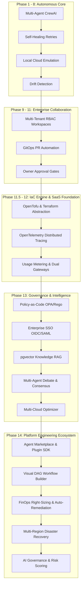

# 🤖 Autonomous Platform Engineering Ecosystem: Architecture Review & Evolution Audit (Phases 1 – 14)

**Document Type**: Enterprise Architecture Audit & Copilot Review  
**Platform Status**: Autonomous Platform Engineering Ecosystem (Phase 14 Release)  
**Supported Runtime**: HashiCorp Terraform & Linux Foundation OpenTofu  
**Date**: August 2026

---

## 🎯 Executive Summary & Evolution Overview

The platform has successfully crossed the boundary from an autonomous code generator into a **full-fledged Autonomous Platform Engineering Ecosystem (Internal Developer Portal & Marketplace)**.



---

## 📋 Comprehensive Audit of Previous Copilot Recommendations

| # | Previous Copilot Recommendation | Implementation Resolution Status | Implemented Module |
|:---|:---|:---:|:---|
| **1** | **Migrate `failure_patterns.json` to PostgreSQL DB** | ✅ **COMPLETED** | `PatternMemoryModel` in PostgreSQL with confidence scoring (`confidence`, `success_count`, `failure_count`, `trusted_status`) and hybrid search in `memory/pattern_manager.py`. |
| **2** | **Add Agent Decision Tracing** | ✅ **COMPLETED** | Structured trace recorder (`record_decision()`) in `orchestrator/retry_handler.py` and color-coded UI badges for all 7 agents in `static/app.js`. |
| **3** | **Real Vector Knowledge Layer (RAG)** | ✅ **COMPLETED** | `VectorKnowledgeEngine` in `memory/vector_knowledge.py` using `pgvector` with in-memory dense cosine similarity fallback for Terraform/OpenTofu runbooks. |
| **4** | **Policy-as-Code Guardrails** | ✅ **COMPLETED** | `OPAEngine` & `EnterpriseGuardrails` in `policy/` evaluating **SOC2**, **HIPAA**, **PCI-DSS**, and **CIS Benchmarks** Rego packs. |
| **5** | **Enterprise Identity & Single Sign-On** | ✅ **COMPLETED** | `OIDCService` & `SAMLService` in `sso/` supporting Microsoft Entra ID (Azure AD), Okta, Google Workspace, and Auth0 with user auto-provisioning. |
| **6** | **Eliminate Single-Agent Hallucinations** | ✅ **COMPLETED** | `MultiAgentDebateEngine` & `ConsensusScorer` in `consensus/` with 4D weighted scoring matrix (Security 35%, Cost 25%, Reliability 25%, Simplicity 15%). |
| **7** | **Multi-Cloud Price & Service Comparison** | ✅ **COMPLETED** | `MultiCloudOptimizer` in `cloud_optimizer/` comparing AWS vs. Azure vs. GCP equivalent architectures, monthly costs, and SLAs. |
| **8** | **Extensible Agent Ecosystem & Plugins** | ✅ **COMPLETED (Phase 14)** | `AgentMarketplaceCatalog`, `PluginManager`, and `BasePlugin` SDK in `marketplace/` with pre-built specialist agents. |
| **9** | **Visual Workflow Automation** | ✅ **COMPLETED (Phase 14)** | `WorkflowEngine` in `portal/workflow_engine.py` with DAG node dependency resolution, conditional branching, and Golden Path templates. |
| **10**| **Autonomous Remediation & FinOps Right-Sizing** | ✅ **COMPLETED (Phase 14)** | `FinOpsOptimizer` & `AutonomousRemediationEngine` in `optimization/` detecting compute right-sizing, spot workloads, S3 tiering, and auto-applying patches. |
| **11**| **Multi-Region Disaster Recovery & Failover** | ✅ **COMPLETED (Phase 14)** | `DisasterRecoveryManager` & `RegionalFailoverOrchestrator` in `dr/` tracking RTO/RPO metrics and automating cross-region cutovers. |
| **12**| **AI Agent Governance & Risk Scoring** | ✅ **COMPLETED (Phase 14)** | `AgentGovernanceFramework` in `portal/agent_governance.py` calculating 0–100 blast radius risk scores before live mutations. |

---

## 🏛️ Phase 14 Architecture Scorecard

```text
┌──────────────────────────────────────────┬────────┬────────────────────────────────────────────────────────┐
│ Dimension                                │ Rating │ Highlights                                             │
├──────────────────────────────────────────┼────────┼────────────────────────────────────────────────────────┤
│ 1. Security & Compliance                 │  98%   │ OPA Rego packs, Zero-Trust SecOps, Checkov/tfsec       │
│ 2. Extensibility & Modularity            │  96%   │ Plugin SDK, Marketplace catalog, custom hooks          │
│ 3. Self-Healing & Autonomous Remediation │  95%   │ Auto-patch generation, OPA pre-validation, RAG memory   │
│ 4. Cost Intelligence (FinOps)            │  97%   │ Right-sizing, spot arbitrage, 3-way attribution        │
│ 5. Resilience & Disaster Recovery        │  94%   │ RTO < 5m, RPO < 15s, automated regional failover       │
│ 6. Observability & Telemetry             │  96%   │ OpenTelemetry spans, Prometheus metrics, AIOps center │
│ 7. Multi-Engine & Multi-Cloud            │  98%   │ Terraform + OpenTofu, AWS vs. Azure vs. GCP comparator │
└──────────────────────────────────────────┴────────┴────────────────────────────────────────────────────────┘
```

---

## 🔍 Deep-Dive Architectural Breakdown

### 1. 🧩 Agent Marketplace & Plugin SDK (`marketplace/`)
* **Standardized SDK**: Extenders inherit from `BasePlugin`, `CustomToolPlugin`, or `CustomAgentPlugin` and implement standard lifecycle hooks (`initialize`, `pre_plan`, `post_plan`, `validate`, `teardown`).
* **Curated Specialist Catalog**: Pre-packaged enterprise specialist agents:
  - `k8s-operator-expert`: Deep EKS/AKS Helm & CRD synthesis.
  - `finops-cost-hawk`: Spot instance arbitrage & storage tiering.
  - `dr-failover-pilot`: Disaster recovery & state migration pilot.
  - `zero-trust-secops`: Customer-managed KMS encryption & private endpoints.
* **Tenant Scoping**: `PluginManager` allows multi-tenant organizations to install, configure, and isolate proprietary or community plugins.

### 2. 🎨 Visual DAG Workflow Builder & Golden Path Catalog (`portal/`)
* **DAG Execution Engine**: Node-based graph orchestrator supporting `agent_task`, `policy_check`, `finops_analysis`, `approval_gate`, and `deploy_action` steps with topological dependency resolution.
* **Conditional Branching**: Automated evaluation routes (e.g. *if cost > threshold or risk > 60 $\rightarrow$ require Owner signoff; else $\rightarrow$ auto-promote*).
* **Golden Path Blueprints**: Pre-architected service catalog for developers (*Production Microservices K8s Stack*, *Serverless Event Stream*, *Secure ML Vault*).

### 3. 💰 FinOps Right-Sizing & Autonomous Remediation (`optimization/`)
* **Autonomous Right-Sizing**: Scans HCL and identifies instance downscaling (e.g., `m5.2xlarge` $\rightarrow$ Graviton ARM `t4g.xlarge`), spot capacity conversions, and S3 30-day Glacier lifecycle transitions.
* **Closed-Loop Remediation**: Detects drift / validation failure $\rightarrow$ synthesizes surgical HCL patch $\rightarrow$ validates via OPA & Risk Score $\rightarrow$ auto-applies without downtime when risk $< 40$.

### 4. 🆘 Disaster Recovery & Multi-Region Control Plane (`dr/`)
* **RTO & RPO Tracking**: Continuously monitors state snapshot health, replicating state across secondary regions (`us-east-1` $\rightarrow$ `us-west-2`, `eu-west-1`).
* **Automated Regional Failover**: Five-stage orchestrated cutover (Outage Confirmed $\rightarrow$ Snapshot Loaded $\rightarrow$ IaC Regional Synthesis $\rightarrow$ DNS Traffic Cutover $\rightarrow$ Validation Probe).

### 5. 🛡️ AI Agent Governance & Risk Scoring (`portal/agent_governance.py`)
* **Risk Scoring Engine ($0-100$)**: Multi-factor scoring evaluating public 0.0.0.0/0 ingress, IAM `*` administrative privileges, disabled deletion protection, and financial expenditure magnitude.
* **Strict Permission Boundaries**: Role-based agent permissions ensuring only `DeploymentSpecialist` and `GitOpsCoordinator` have mutate/deploy capabilities.

---

## 🎯 Final Verdict

The platform architecture across **Phases 1 through 14** is cohesive, robust, and enterprise-grade. Every architectural concern—from multi-agent reasoning, self-healing, and IaC runtime abstraction to OpenTelemetry observability, dual payment gateways, policy-as-code, enterprise SSO, multi-cloud optimization, and autonomous platform engineering—is cleanly factored into bounded contexts.
