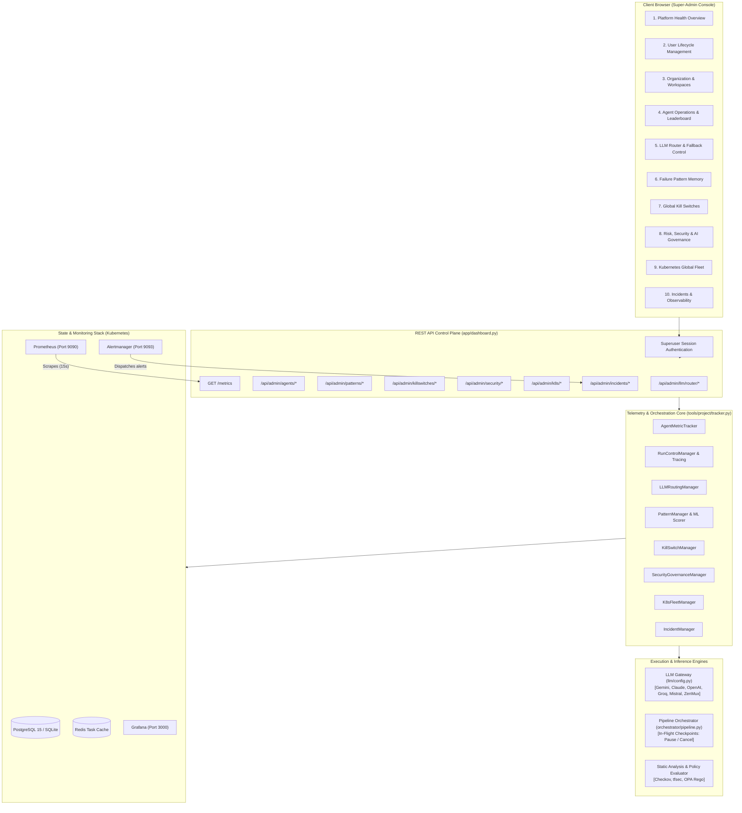

# 🛡️ Super-Admin Platform Operations Command Center: Comprehensive Technical Manual

The **Super-Admin Platform Operations Command Center** (`/admin`) is the mission-critical central nervous system for platform administrators, site reliability engineers (SREs), cloud architects, and security officers managing the Autonomous Infrastructure Platform.

It elevates basic administrative CRUD capabilities into a comprehensive **Platform Engineering Operating System**, providing real-time multi-agent supervision, multi-provider LLM routing with emergency fallbacks, machine-learned failure pattern memory, global operational circuit breakers, policy-as-code risk governance, multi-cluster Kubernetes fleet orchestration, and automated incident triage with AI-synthesized root cause analysis.

---

## 📐 1. System Architecture & Topology



---

## 🎛️ 2. Core Command Center Subsystems

### 2.1. Platform Health Overview (Priority 1)
- **Executive Vitals Strip**: Aggregates cross-tenant metrics including Total Organizations, Active Users, Running Pipeline Deployments, Queued Tasks, Failed Workflows, Worker Utilization %, and Infrastructure Drift.
- **Database & Cache Health Matrix**: Real-time heartbeat probes for PostgreSQL and Redis with connection pooling status and latency benchmarks.
- **Recent Platform Activity Stream**: Unified log stream capturing cross-organization provisioning, approvals, and mutations.

### 2.2. User & Organization Lifecycle Management
- **User Directory**: View all registered users, tenant affiliations, roles (`owner`, `admin`, `member`, `viewer`), creation dates, and statuses (`active`, `suspended`).
- **Super-Admin Privilege Escalation**: Secure toggle to grant or revoke platform-level super-admin rights with mandatory audit logging.
- **Account Suspension & Reactivation**: Immediate 1-click account freeze revoking session tokens and halting active deployments.
- **Organization Tenant Overrides**: Modify organization subscription tiers (`Free`, `Pro Developer`, `Enterprise Team`) and bypass execution quotas.

### 2.3. Agent Operations Center & Live Leaderboard (Priority 2)
Supervises the platform's 7 specialized autonomous agents:
1. **ArchitectAgent**: High-level topology design, multi-region planning, and component decomposition.
2. **DeveloperAgent**: Production-grade modular Terraform/OpenTofu HCL code generation.
3. **SecurityReviewer**: Dual-engine static analysis (Checkov + tfsec) and CIS benchmark compliance.
4. **FinOpsSpecialist**: Monthly cloud expenditure forecasting, spot/graviton right-sizing, and cost optimization.
5. **TestingAgent**: Post-apply smoke validation, HTTP probes, and infrastructure behavior verification.
6. **GitOpsCoordinator**: Automated Git branch management, deterministic commit creation, and Pull Request authoring.
7. **DeploymentPlanner**: Execution graph dependency sequencing, blast radius estimation, and rollback planning.

#### Fleet Health & Telemetry
- Real-time success rates (`98.6%`), total execution counters, failure tallies, and average run durations.
- **Agent Leaderboard**: Identifies operational outliers across 4 core KPIs:
  - **Most Used Agent**: Peak operational demand.
  - **Highest Failure Rate**: Identifies agents requiring prompt tuning or updated pattern memory.
  - **Top Token Consumer**: Highlights token-heavy reasoning loops.
  - **Most Expensive Agent**: Attributed dollar cost per agent.

#### In-Flight Run Inspection & Intervention
- **Stage Waterfall Traces (`PipelineStageTraceModel`)**: Visual step-by-step breakdown of active pipeline runs (`architect_design` ➔ `developer_code` ➔ `security_audit` ➔ `finops_estimate` ➔ `gitops_pr`).
- **In-Flight Run Interventions**:
  - **Pause**: Halts the running pipeline at the next stage checkpoint in a low-frequency 1.5s sleep loop without burning compute.
  - **Resume**: Restores execution immediately from the paused stage.
  - **Cancel**: Aborts execution safely, terminates downstream worker tasks, and records a clean audit cancellation record.

---

### 2.4. LLM Router & Fallback Policy Control Center (Priority 3)
Provides microsecond routing governance across 9 major AI providers: **Google Gemini**, **Anthropic Claude**, **OpenAI**, **Groq LPU**, **Mistral AI**, **ZenMux AI**, **OpenRouter**, **NVIDIA NIM**, and **Local Ollama**.

#### Routing Modes
- **`auto`**: Dynamically routes requests based on task complexity (e.g., lightweight models for linting/formatting, frontier reasoning models for architectural synthesis).
- **`force`**: Super-admin override directing 100% of platform traffic to a single selected provider (useful during enterprise SLA testing or contract volume commitments).
- **`failover_chain`**: Strict sequential fallback through an admin-defined priority list upon receiving HTTP 429, 500, or timeout errors.

#### Enterprise Controls
- **1-Click Emergency Provider Isolation**: Toggle switches instantly disable failing providers. State is dual-written to `os.environ[f"LLM_PROVIDER_{provider.upper()}_STATUS"]` for microsecond in-memory lookups.
- **Dynamic Fallback Chain Reordering**: Drag-and-drop or modal priority list hot-reloading candidate models inside `llm/config.py`.
- **Synthetic Route Diagnostic Probe**: Sends real-time non-intrusive probe prompts to test provider availability, latency (ms), and output validity.

---

### 2.5. Dynamic Pattern Memory & Self-Learning Management (Priority 4)
Exposes and governs the platform's self-healing knowledge bank (`PatternMemoryModel`).

- **Reinforcement Confidence Scoring**: Tracks failure patterns with machine learning-style weights:
  $$\text{Confidence} = \frac{\text{Successes}}{\text{Successes} + \text{Failures}} \times \text{Recency Factor}$$
- **Pattern Categorization**: Structured taxonomy across `provider` (cloud API), `syntax` (HCL errors), `iam` (permissions/roles), `quota` (resource limits), and `general`.
- **Manual Oversight Controls**:
  - **Promote Pattern**: Marks verified community/internal fixes as **Trusted** for instant injection into the DeveloperAgent prompt.
  - **Disable / Enable Pattern**: Quarantines poisoned or outdated fixes without deleting historical training data.
  - **Edit Pattern**: Update error regex substrings and remediation advice directly from the UI.
  - **Delete Pattern**: Permanently removes obsolete patterns.

---

### 2.6. Global Operational Kill Switches (Priority 6)
Enterprise-grade circuit breakers allowing super-admins to neutralize platform subsystems during incidents:

| Kill Switch ID | Scope | Impact |
|:---|:---|:---|
| `disable_all_deployments` | Platform Wide | Immediately blocks all `terraform apply` and cloud mutation jobs. |
| `disable_gitops_pr` | Pull Requests | Halts automated branch creation and GitHub/GitLab PR synthesis. |
| `disable_self_healing` | AI Agent Loop | Disables autonomous error reflection and retry rounds. |
| `disable_marketplace_plugins` | Plugin Ecosystem | Quarantines all third-party community plugins and lifecycle hooks. |
| `disable_new_user_registration` | Identity Gateway | Prevents new tenant signups while existing users remain active. |

> [!IMPORTANT]
> **Audit Trail Mandatory Justification**: Every kill switch activation or deactivation requires an administrative audit justification string recorded permanently in `GlobalAuditVault`.

---

### 2.7. Risk, Security & AI Governance Command Center (Priority 7 & 12)
Comprehensive governance, compliance auditing, and policy enforcement suite:

- **Executive Security KPI Strip**: Tracks Critical Vulnerabilities, High Severity Findings, Blocked Deployments, Global Compliance Score % (SOC2, ISO27001, HIPAA readiness), and Active Policy Guardrails.
- **Live Threat & Policy Violation Alerts**: Real-time ticker streaming blocked pipeline actions (e.g., `[BLOCKED] 0.0.0.0/0 public ingress proposed on security group`).
- **Policy Engine Control Center**: 12 pre-configured enterprise guardrails across IAM, Network, Storage Encryption, and Tagging. Runtime toggles allow switching between **Blocking** (strictly halts pipeline execution), **Advisory** (emits warnings), or **Disabled**.
- **Security Vulnerabilities & Finding Tracker**: Searchable vulnerability matrix across all projects. Supports status transitions (`open` ➔ `blocked` ➔ `resolved` ➔ `suppressed`).
- **AI Governance & Consensus Decision Traces**: Explainable audit trail tracking agent decisions with Composite Risk Scores (0–100), Auditor Confidence %, Consensus Votes, and 5-factor risk breakdowns (*Security, Financial, Availability, Data Loss, Compliance*).
- **On-Demand Security Scanner**: Modal interface to trigger instant Checkov and OPA static policy audits against any project workspace.

---

### 2.8. Kubernetes Global Fleet & Node Control Center (Priority 8)
Multi-cluster orchestration and container infrastructure visibility:

- **Multi-Cluster Context Selector**: Seamless switching between control plane (`docker-desktop`) and remote clusters (`aws-eks-prod`, `gcp-gke-staging`).
- **Node Resource Allocation Vitals**: Live metrics for Node CPU Allocation (`1.25 / 4.0 Cores`, 31.2%), Memory Allocation (`2.4 / 8.0 GB`, 30.0%), and Pod Fleet Density (`7 / 110 Pods`, 6.4%).
- **Active Workloads & Pod Health Matrix**: Real-time inspection of all platform pods (`dashboard`, `operator`, `db`, `redis`, `prometheus`, `grafana`, `alertmanager`) displaying replica counts, statuses, restarts, CPU/Memory resource requests, and node distribution.
- **Pod Container Live Logs Stream**: Interactive modal streaming stdout/stderr buffers directly from Kubernetes worker pods with live refresh.
- **GitOps State & Drift Dashboard**: Monitors cloud drift across managed workspaces with a 1-click **Reconcile Drift** trigger queuing cluster-wide operator scans.

---

### 2.9. Incident Management & In-Cluster Observability (Priority 9)
End-to-end site reliability engineering and outage response center:

- **In-Cluster Monitoring Stack**:
  - **Prometheus** (Port `9090`): In-cluster time-series scraper querying `/metrics` every 15 seconds.
  - **Grafana** (Port `3000`): Live telemetry visualization and operational dashboards.
  - **Alertmanager** (Port `9093`): Inbound/outbound alert routing and notification dispatching.
- **Prometheus `/metrics` Exposition**: Exposes standardized Prometheus text-format metrics across agent executions, durations, LLM requests, latencies, costs, security findings, compliance ratio, drift counts, and active incidents.
- **Incident KPIs Strip**: Real-time metrics for Active Incidents, P1 Critical Outages, Mean Time to Recovery (MTTR: 18.5m), and Resolved Incidents.
- **Incident Triage Matrix**: Searchable register supporting severity filtering (`P1`–`P4`) and status progression (`open`, `acknowledged`, `mitigating`, `resolved`).
- **AI Root Cause Analysis (RCA) Engine**: Correlates failure telemetry with historical pattern memory to synthesize:
  - **Root Cause**: Underlying technical failure mechanism.
  - **Trigger**: The specific prompt, configuration change, or cloud mutation that initiated the outage.
  - **Blast Radius**: Impacted services, workspaces, and organizations.
  - **Suggested Remediation**: Surgical fix synthesized from pattern memory.
- **Alert Webhook Dispatchers**: Modal manager supporting notification channels for Slack, PagerDuty, Discord, or generic JSON webhooks with synthetic latency benchmarking.
- **Inbound Alertmanager Webhook Receiver**: Endpoint (`POST /api/admin/incidents/webhook`) processing incoming Prometheus alerts.

---

## 📡 3. Complete REST API Reference

All Super-Admin endpoints require an authenticated session where `user.is_superuser == True`. Unauthorized requests receive HTTP 403 Forbidden.

### 3.1. Agent Operations APIs
| Method | Endpoint | Description |
|:---|:---|:---|
| `GET` | `/api/admin/agents/health` | Returns fleet health for all 7 agents (runs, failure rate, latency). |
| `GET` | `/api/admin/agents/leaderboard` | Returns top performers across 4 KPI categories. |
| `GET` | `/api/admin/agents/runs` | Returns active and recent pipeline execution runs. |
| `GET` | `/api/admin/agents/runs/{slug}/trace` | Returns waterfall stage execution trace for a project run. |
| `POST` | `/api/admin/agents/runs/{slug}/pause` | Pauses an in-flight pipeline run at the next checkpoint. |
| `POST` | `/api/admin/agents/runs/{slug}/resume` | Resumes a paused pipeline run. |
| `POST` | `/api/admin/agents/runs/{slug}/cancel` | Aborts an in-flight pipeline run safely. |

### 3.2. LLM Router APIs
| Method | Endpoint | Description |
|:---|:---|:---|
| `GET` | `/api/admin/llm/router` | Returns multi-provider matrix, active mode, and fallback chain. |
| `POST` | `/api/admin/llm/router/provider/{provider}` | Toggles provider status (`enabled: true/false`). |
| `POST` | `/api/admin/llm/router/mode` | Sets routing mode (`auto`, `force`, `failover_chain`). |
| `POST` | `/api/admin/llm/router/fallback-chain` | Updates priority order of fallback providers. |
| `POST` | `/api/admin/llm/router/test` | Sends synthetic probe prompt to benchmark provider latency. |

### 3.3. Failure Pattern Memory APIs
| Method | Endpoint | Description |
|:---|:---|:---|
| `GET` | `/api/admin/patterns` | Lists all learned failure patterns with confidence scores. |
| `POST` | `/api/admin/patterns` | Creates a new failure pattern manually. |
| `PUT` | `/api/admin/patterns/{pattern_id}` | Updates regex match, category, severity, or remediation. |
| `POST` | `/api/admin/patterns/{pattern_id}/toggle` | Enables or disables a pattern. |
| `POST` | `/api/admin/patterns/{pattern_id}/promote` | Promotes a pattern to verified "Trusted" status. |
| `DELETE` | `/api/admin/patterns/{pattern_id}` | Deletes a pattern from the knowledge bank. |

### 3.4. Global Kill Switch APIs
| Method | Endpoint | Description |
|:---|:---|:---|
| `GET` | `/api/admin/killswitches` | Returns states and audit justifications for all circuit breakers. |
| `POST` | `/api/admin/killswitches/{switch_id}` | Toggles a kill switch state (`enabled: true/false`, `reason`). |

### 3.5. Risk, Security & AI Governance APIs
| Method | Endpoint | Description |
|:---|:---|:---|
| `GET` | `/api/admin/security/overview` | Executive KPI overview (critical/high counts, compliance %). |
| `GET` | `/api/admin/security/alerts` | Live stream of recent security violations and OPA blocks. |
| `GET` | `/api/admin/security/policies` | Lists 12 policy guardrails and enforcement modes. |
| `PUT` | `/api/admin/security/policies/{rule_id}` | Updates rule mode (`blocking`, `advisory`, `disabled`). |
| `GET` | `/api/admin/security/findings` | Lists vulnerabilities filtered by severity, status, and org. |
| `PATCH` | `/api/admin/security/findings/{id}` | Updates finding status (`open`, `blocked`, `resolved`, `suppressed`). |
| `GET` | `/api/admin/security/governance` | Lists explainable AI consensus decision traces. |
| `POST` | `/api/admin/security/scan` | Runs on-demand static HCL and OPA audit against a project. |

### 3.6. Kubernetes Global Fleet APIs
| Method | Endpoint | Description |
|:---|:---|:---|
| `GET` | `/api/admin/k8s/cluster` | Returns node CPU/Memory allocations and control plane status. |
| `GET` | `/api/admin/k8s/pods` | Returns active workloads, statuses, restarts, and resource requests. |
| `GET` | `/api/admin/k8s/crds` | Returns registered CRDs and active instance counts. |
| `GET` | `/api/admin/k8s/drift` | Returns GitOps drift metrics and drifted workspaces. |
| `POST` | `/api/admin/k8s/drift/reconcile` | Queues cluster-wide drift reconciliation scan. |
| `GET` | `/api/admin/k8s/pods/{pod_name}/logs`| Streams live stdout/stderr log buffer from worker pod. |

### 3.7. Observability & Incident Management APIs
| Method | Endpoint | Description |
|:---|:---|:---|
| `GET` | `/metrics` | Standard Prometheus text exposition endpoint (unauthenticated). |
| `GET` | `/api/admin/incidents/overview` | Returns active incidents, P1 outages, MTTR, and resolved tallies. |
| `GET` | `/api/admin/incidents` | Lists incidents filtered by severity, status, and search query. |
| `GET` | `/api/admin/incidents/{id}` | Returns incident details with timeline and impact scope. |
| `PATCH` | `/api/admin/incidents/{id}` | Transitions incident lifecycle (`status`, `notes`) with audit log. |
| `POST` | `/api/admin/incidents/{id}/rca` | Synthesizes AI Root Cause Analysis from failure telemetry. |
| `GET` | `/api/admin/incidents/webhooks/list` | Lists configured alert webhook notification channels. |
| `POST` | `/api/admin/incidents/webhooks` | Registers a new Slack, PagerDuty, Discord, or generic channel. |
| `POST` | `/api/admin/incidents/webhooks/test` | Dispatches synthetic test ping measuring latency. |
| `POST` | `/api/admin/incidents/webhook` | Inbound receiver processing alerts from Prometheus Alertmanager. |

---

## 📊 4. Prometheus `/metrics` Exposition Specification

The `/metrics` endpoint implements the Prometheus text-based exposition format:

```text
# HELP terraform_ai_agent_executions_total Total agent task executions
# TYPE terraform_ai_agent_executions_total counter
terraform_ai_agent_executions_total{agent="ArchitectAgent",status="success"} 48
terraform_ai_agent_executions_total{agent="ArchitectAgent",status="failed"} 1
terraform_ai_agent_executions_total{agent="DeveloperAgent",status="success"} 142
terraform_ai_agent_executions_total{agent="DeveloperAgent",status="failed"} 2
terraform_ai_agent_executions_total{agent="SecurityReviewer",status="success"} 89
terraform_ai_agent_executions_total{agent="SecurityReviewer",status="failed"} 0

# HELP terraform_ai_agent_duration_seconds Average duration of agent execution
# TYPE terraform_ai_agent_duration_seconds gauge
terraform_ai_agent_duration_seconds{agent="ArchitectAgent"} 4.2
terraform_ai_agent_duration_seconds{agent="DeveloperAgent"} 8.5
terraform_ai_agent_duration_seconds{agent="SecurityReviewer"} 3.1

# HELP terraform_ai_llm_requests_total Total LLM API calls
# TYPE terraform_ai_llm_requests_total counter
terraform_ai_llm_requests_total{provider="gemini"} 1420
terraform_ai_llm_latency_seconds{provider="gemini"} 0.850
terraform_ai_llm_cost_dollars_total{provider="gemini"} 1.4200
terraform_ai_llm_requests_total{provider="claude"} 420
terraform_ai_llm_latency_seconds{provider="claude"} 1.620
terraform_ai_llm_cost_dollars_total{provider="claude"} 3.8400

# HELP terraform_ai_security_violations_total Active security findings
# TYPE terraform_ai_security_violations_total gauge
terraform_ai_security_violations_total{severity="critical"} 0
terraform_ai_security_violations_total{severity="high"} 2
terraform_ai_compliance_score_ratio 0.9400

# HELP terraform_ai_drift_detected_total Active drifted projects count
# TYPE terraform_ai_drift_detected_total gauge
terraform_ai_drift_detected_total 0

# HELP terraform_ai_incidents_active Current active incidents
# TYPE terraform_ai_incidents_active gauge
terraform_ai_incidents_active{severity="P1"} 1
terraform_ai_incidents_active{severity="all"} 3
```

---

## 💾 5. Database Schema & Data Models

All models inherit from SQLAlchemy declarative `Base` in `tools/project/tracker.py`:

```mermaid
erDiagram
    AgentMetricModel {
        int id PK
        string agent_name UK
        int total_runs
        int successful_runs
        int failed_runs
        float total_duration_seconds
        float total_cost
        int total_tokens
    }

    LLMProviderMetricModel {
        int id PK
        string provider UK
        boolean is_enabled
        int request_count
        int error_count
        float avg_latency_ms
        float total_cost
    }

    PipelineStageTraceModel {
        int id PK
        string project_slug
        string stage_name
        string status
        float duration_seconds
        datetime started_at
        datetime finished_at
        json error_details
    }

    PatternMemoryModel {
        int id PK
        string error_substring
        string category
        string severity
        float confidence_score
        int success_count
        int failure_count
        boolean is_trusted
        boolean is_enabled
        text recommended_fix
    }

    KillSwitchModel {
        int id PK
        string switch_key UK
        boolean is_enabled
        string description
        string category
        string last_toggled_by
        string last_toggle_reason
        datetime updated_at
    }

    SecurityFindingModel {
        int id PK
        string rule_id
        string severity
        string title
        string resource
        string project_slug
        string status
        string detector
    }

    PolicyRuleModel {
        int id PK
        string rule_id UK
        string name
        string category
        string enforcement_mode
        string description
    }

    GovernanceDecisionModel {
        int id PK
        string project_slug
        string decision
        float risk_score
        string risk_level
        float confidence_score
        string auditor_agent
        json risk_factors
    }

    IncidentModel {
        string id PK
        string title
        string severity
        string status
        string source
        string impact_scope
        string affected_org_name
        text summary
        json root_cause_analysis
        json timeline
        datetime created_at
        datetime resolved_at
    }

    AlertWebhookModel {
        int id PK
        string name
        string url
        string type
        string min_severity
        boolean is_active
        datetime created_at
    }
```



---

## 🛠️ 6. Administrator Operational Runbooks

### Runbook A: Provider Outage Emergency Failover
1. Navigate to **LLM Router** (`#tab-llm-router`).
2. Identify failing provider (spiking error rate or high latency).
3. Toggle the provider switch to **OFF** (`POST /api/admin/llm/router/provider/{provider}`).
4. If traffic must be pinned to a backup provider, switch **Routing Strategy** to `force` and select the target provider.
5. In-memory hot reloading takes effect within microseconds; ongoing agent completions automatically route to the fallback candidate list.

### Runbook B: In-Flight Rogue Agent Mitigation
1. Navigate to **Agent Operations** (`#tab-agents`).
2. Locate the impacted workspace in the **Active Pipeline Runs** table.
3. Click **Inspect** to review the waterfall trace and active stage.
4. Click **Pause Run** to freeze execution without terminating state.
5. Inspect logs or error output. If unrecoverable, click **Cancel Run** to abort the pipeline and clear worker task queues.

### Runbook C: Critical Security Block Resolution
1. Navigate to **Security & Governance** (`#tab-security`).
2. Review the **Live Threat Alerts** ticker or filter findings by `Severity: Critical`.
3. If an emergency deployment was blocked by an overly strict policy, locate the rule in the **Enterprise Policy Guardrails** list.
4. Change the enforcement mode from **Blocking** to **Advisory** (`PUT /api/admin/security/policies/{rule_id}`).
5. Re-run the security scan via **Execute Security Scan** modal to verify the new composite risk score.

### Runbook D: P1 Outage Incident Triage & AI RCA
1. Navigate to **Incidents & Observability** (`#tab-incidents`).
2. Filter the incident table by `Severity: P1`.
3. Click **Triage / RCA** to open the incident inspector.
4. Click **Re-Synthesize** to generate an updated AI Root Cause Analysis correlating failure logs with pattern memory.
5. Review the suggested remediation patch and update the lifecycle state to **Mitigating** or **Resolved**.
6. Actions are logged permanently to the `GlobalAuditVault`.

---

*Last Updated: 2026-09-19 | Platform Control Plane Specification*
