# 🤖 Phase 13: Enterprise Platform Engineering, AI Operations & Governance

## 🎯 Overview

Phase 13 transforms the platform into a fully governed Enterprise Autonomous Infrastructure Platform.

Key objectives:

- Enterprise SSO & Identity Federation
- Policy-as-Code Governance
- AI Operations Center
- Multi-Agent Consensus & Debate
- Vector Knowledge Platform
- Kubernetes Worker Autoscaling
- Multi-Cloud Optimization
- Customer Managed Cloud Accounts
- Compliance Packs (SOC2, HIPAA, PCI-DSS)
- AI Cost Optimization & Model Routing

---

# 🏗️ Enterprise Platform Architecture

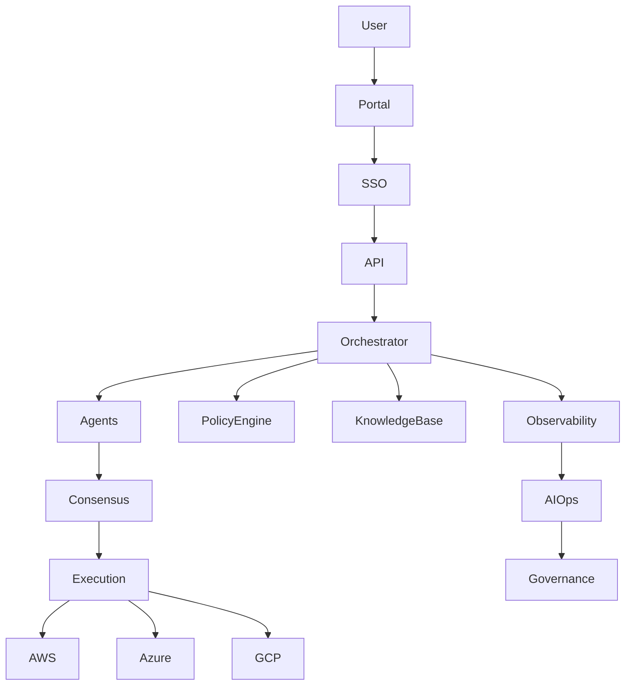

---

# 🔐 Enterprise Identity & SSO

Supported providers:

- Azure AD / Entra ID
- Okta
- Google Workspace
- Auth0
- SAML 2.0
- OIDC

## Authentication Flow

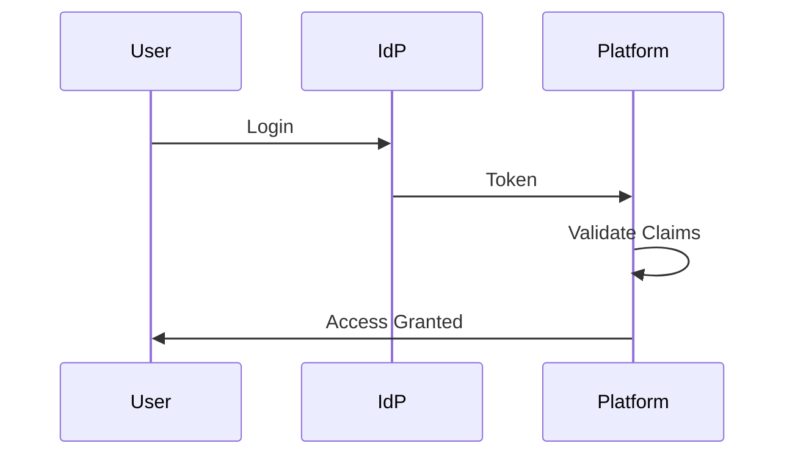

---

# 🛡️ Policy as Code

All deployments pass through a policy engine.

Supported:

- OPA (Open Policy Agent)
- Rego Policies
- Organization Guardrails

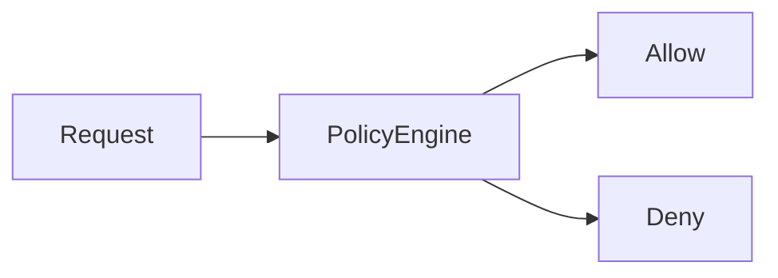

Examples:

- Block public S3 buckets
- Enforce encryption
- Restrict regions
- Budget enforcement

---

# 🤖 Multi-Agent Debate & Consensus

Instead of a single Developer Agent:

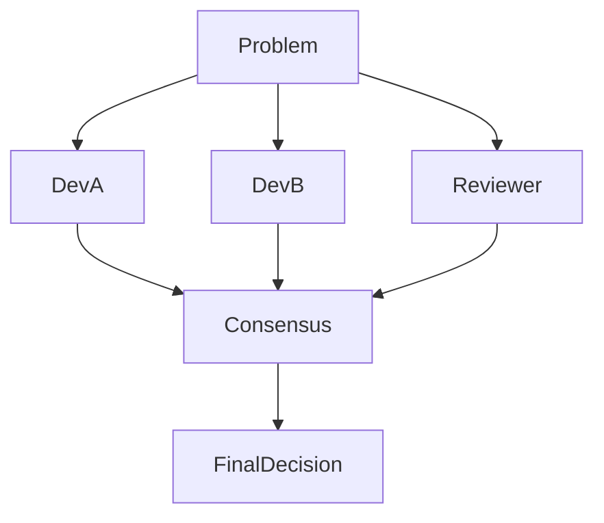

Capabilities:

- Competing solutions
- Consensus scoring
- Higher confidence outputs
- Reduced hallucinations

---

# 📚 Enterprise Knowledge Platform

Vector database stores:

- Terraform docs
- OpenTofu docs
- Cloud provider docs
- Internal runbooks
- Failure patterns

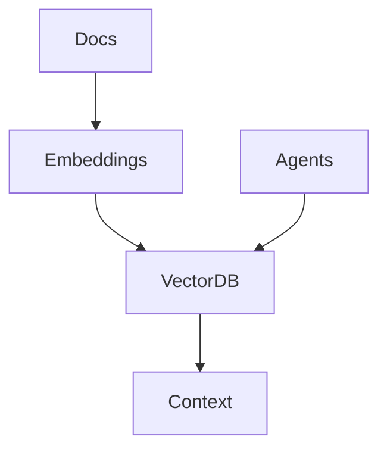

Recommended:

- Qdrant
- Weaviate
- Pinecone
- pgvector

---

# ☁️ Multi-Cloud Optimization Engine

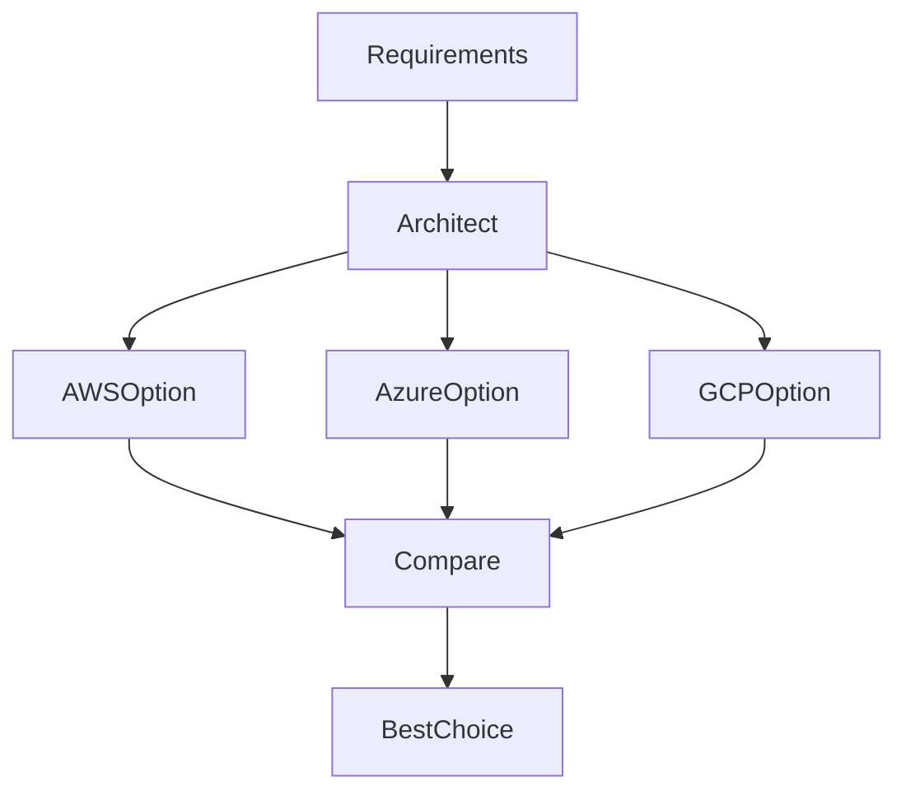

Optimization Factors:

- Cost
- Availability
- Compliance
- Regional Presence
- Service Limits

---

# ⚙️ Kubernetes Worker Autoscaling

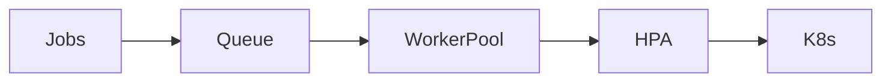

Features:

- Horizontal scaling
- Queue-based scaling
- Cost optimization
- Fault tolerance

---

# 📈 AI Operations Center (AIOps)

Monitor:

- Agent health
- Failure rates
- Retry frequency
- Pattern effectiveness
- Deployment trends

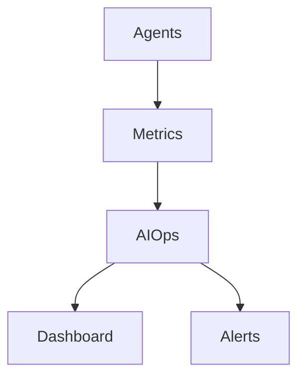

---

# 💰 Intelligent Model Routing

Automatically select the best model.

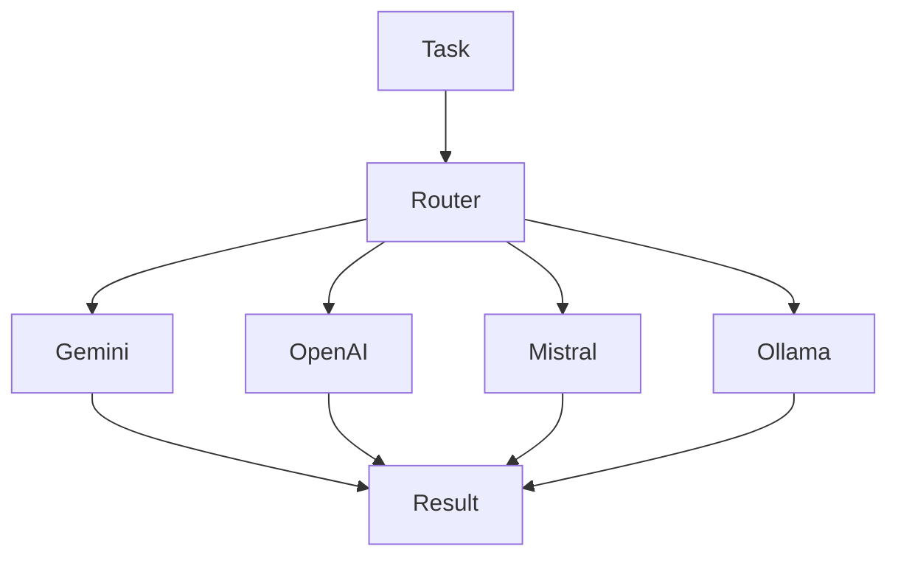

Decision Factors:

- Cost
- Performance
- Latency
- Availability

---

# 🏢 Customer Managed Cloud Accounts

Support:

- Bring Your Own AWS Account
- Bring Your Own Azure Subscription
- Bring Your Own GCP Project

Architecture:

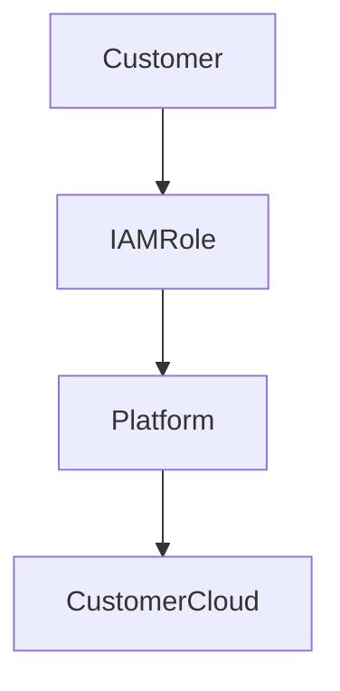

Benefits:

- Strong tenant isolation
- Customer ownership
- Better compliance

---

# 📜 Compliance Packs

Available Packs:

- SOC2
- HIPAA
- PCI-DSS
- ISO 27001
- CIS Benchmarks

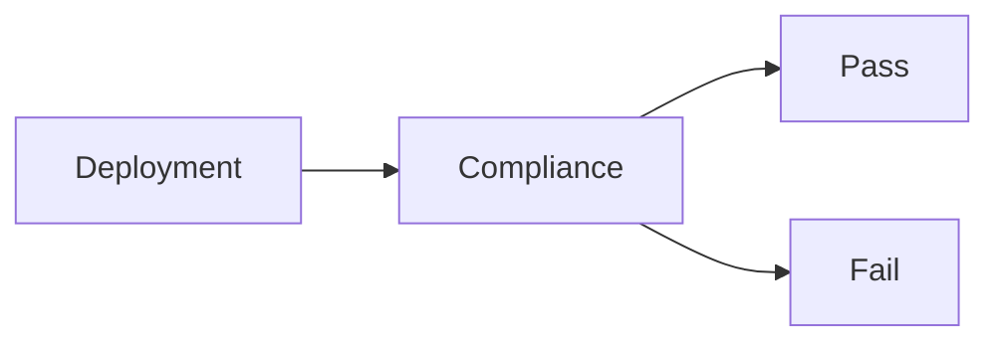

---

# 📊 Executive Governance Dashboard

Widgets:

- Compliance Score
- Monthly Spend
- Deployment Success Rate
- Security Findings
- Pattern Learning Effectiveness
- Organization Activity

---

# 📂 New Project Structure

```text
policy/
├── opa/
├── rego/
└── compliance/

knowledge/
├── vector_store/
├── embeddings/
└── documents/

aiops/
├── monitoring.py
├── alerts.py
└── governance.py

sso/
├── oidc.py
├── saml.py
└── providers.py
```

---

# 🚀 Phase 13 Outcome

The platform evolves from:

```text
Enterprise SaaS Infrastructure Platform
```

into:

```text
Enterprise Autonomous Infrastructure Operating System
```

Capabilities:

✅ SSO & Identity Federation
✅ Policy-as-Code
✅ AI Governance
✅ Multi-Agent Consensus
✅ Vector Knowledge Platform
✅ Multi-Cloud Optimization
✅ Kubernetes Autoscaling
✅ Enterprise Compliance
✅ Customer Managed Clouds
✅ Intelligent Model Routing

---

*Phase 13 - Enterprise Platform Engineering, AI Operations & Governance*
