# 🤖 Phase 14: Autonomous Platform Operations, Marketplace & Self-Optimizing Infrastructure

## 🎯 Overview

Phase 14 evolves the platform from an Enterprise Autonomous Infrastructure Operating System into a fully autonomous Platform Engineering Ecosystem.

Core objectives:

- Internal Developer Portal (IDP)
- Agent Marketplace
- Plugin SDK
- Workflow Builder
- Self-Optimizing Infrastructure
- Disaster Recovery Automation
- Multi-Region Control Plane
- Enterprise API Marketplace
- FinOps Optimization Engine
- AI Agent Governance Framework
- Autonomous Remediation

---

# 🏗️ Phase 14 Platform Architecture

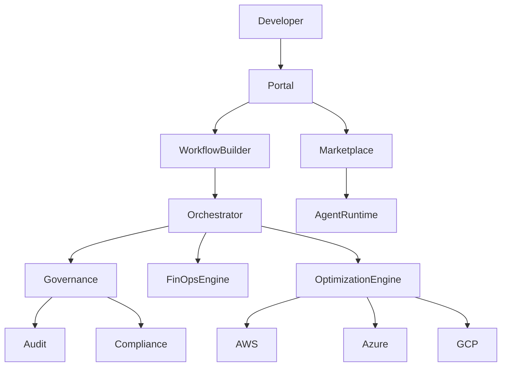

---

# 🧩 Agent Marketplace

Organizations can install reusable agents.

Examples:

- Terraform Expert Agent
- Kubernetes Expert Agent
- FinOps Agent
- Security Compliance Agent
- Disaster Recovery Agent

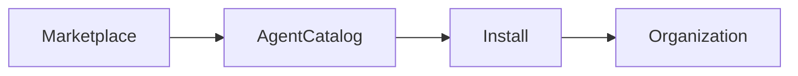

---

# 🔌 Plugin SDK

Organizations can build custom plugins.

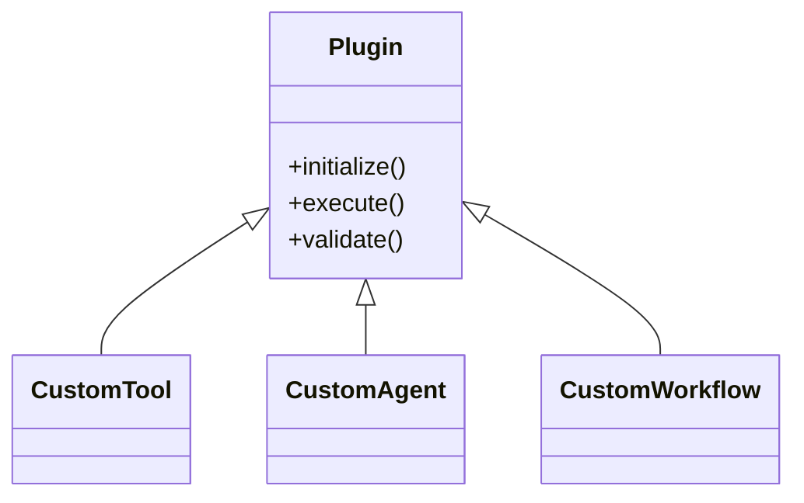

---

# 🎨 Visual Workflow Builder

Allows drag-and-drop workflow creation.

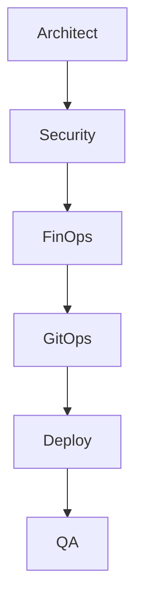

Capabilities:

- No-code automation
- Conditional logic
- Human approval gates
- Reusable templates

---

# 🤖 Autonomous Remediation Engine

Detects and fixes issues automatically.

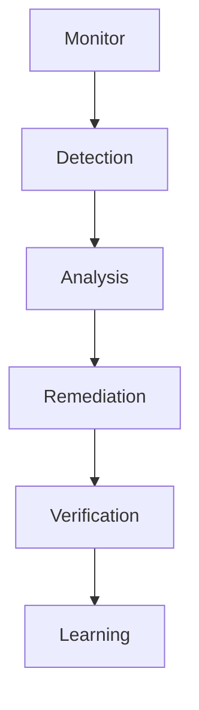

Examples:

- Failed deployment recovery
- Drift correction
- Service restart automation
- Security remediation

---

# 💰 FinOps Optimization Engine

Continuously analyzes infrastructure.

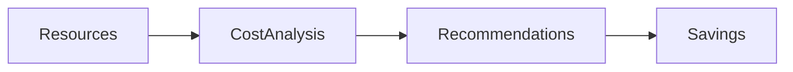

Recommendations:

- Reserved instances
- Spot workloads
- Right sizing
- Storage optimization

---

# 🌍 Multi-Region Control Plane

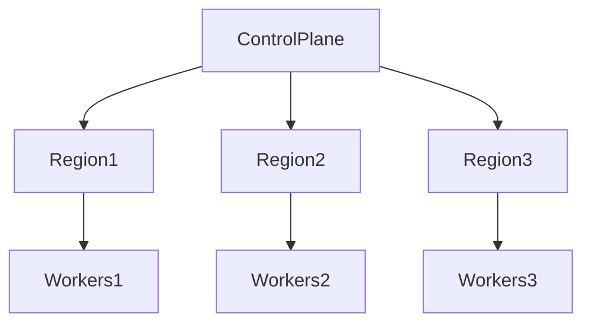

Benefits:

- High availability
- Regional failover
- Global scalability

---

# 🆘 Disaster Recovery Automation

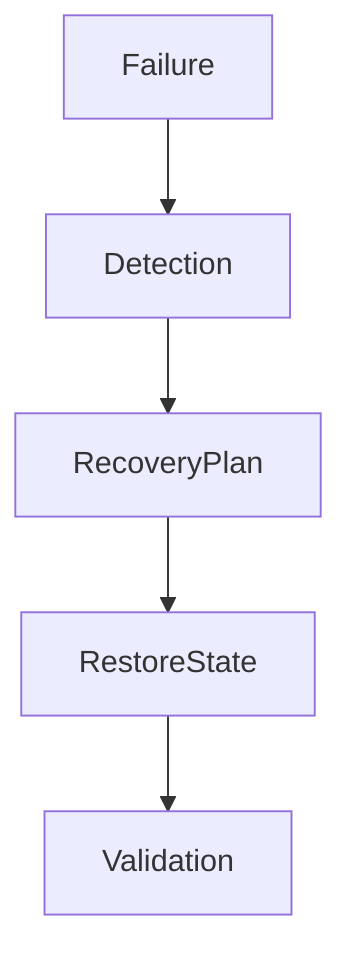

Capabilities:

- Cross-region backups
- State recovery
- Automated failover
- Recovery testing

---

# 🏢 Internal Developer Portal

Single pane of glass for:

- Projects
- Organizations
- Workflows
- Infrastructure catalog
- Agent marketplace
- Approvals
- Cost reports

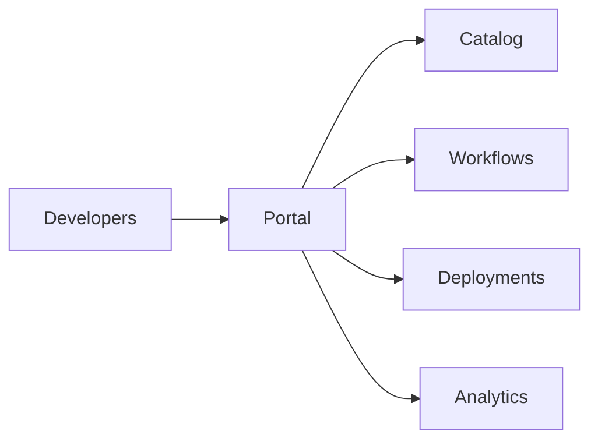

---

# 📚 Enterprise API Marketplace

Expose platform capabilities through APIs.

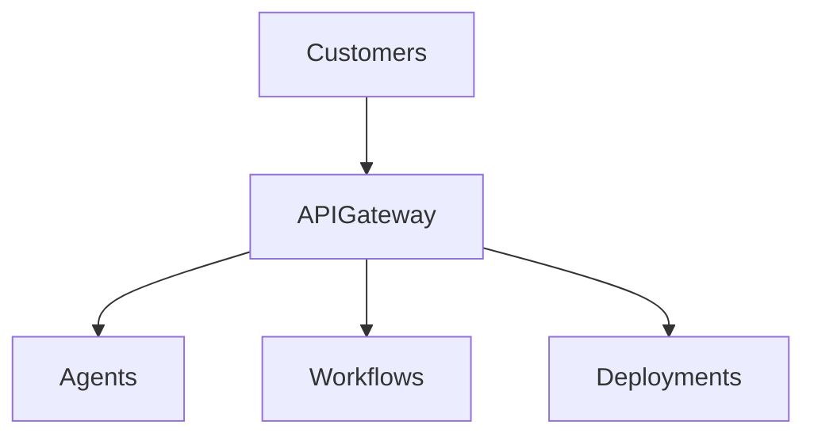

Supported APIs:

- Infrastructure Generation API
- Deployment API
- Cost Analysis API
- Governance API

---

# 🛡️ AI Agent Governance Framework

Track and govern all agent behavior.

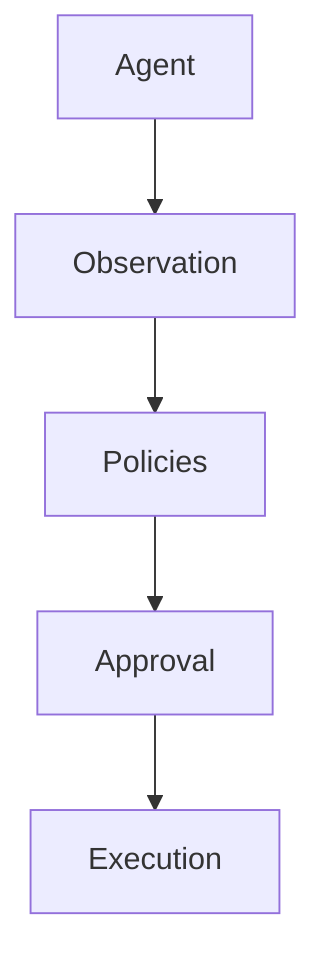

Governance controls:

- Agent permissions
- Approval thresholds
- Execution limits
- Risk scoring

---

# 📊 Autonomous Platform Analytics

Monitors:

- Platform health
- Agent effectiveness
- Cost savings generated
- Automation coverage
- Recovery success rate

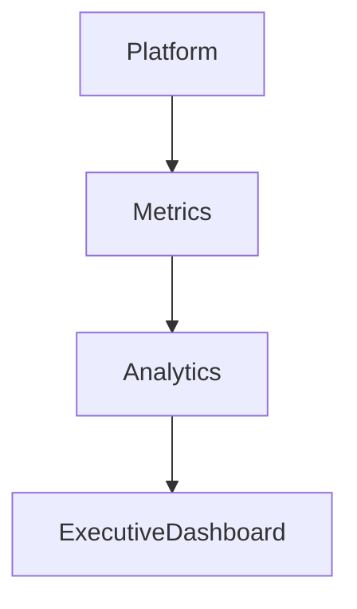

---

# 📂 New Project Structure

```text
marketplace/
├── agents/
├── plugins/
└── catalog/

portal/
├── workflows/
├── templates/
└── approvals/

optimization/
├── finops/
├── remediation/
└── recommendations/

dr/
├── backups/
├── recovery/
└── failover/
```

---

# 🚀 Phase 14 Outcome

The platform evolves from:

```text
Enterprise Autonomous Infrastructure Operating System
```

into:

```text
Autonomous Platform Engineering Ecosystem
```

Capabilities:

✅ Agent Marketplace
✅ Plugin SDK
✅ Internal Developer Portal
✅ Workflow Builder
✅ Autonomous Remediation
✅ FinOps Optimization
✅ Multi-Region Control Plane
✅ Disaster Recovery Automation
✅ Enterprise API Marketplace
✅ AI Governance Framework

---

*Phase 14 - Autonomous Platform Operations, Marketplace & Self-Optimizing Infrastructure*
