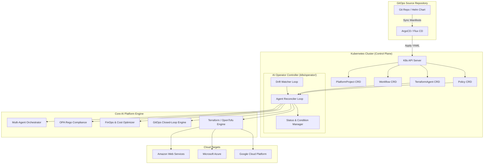
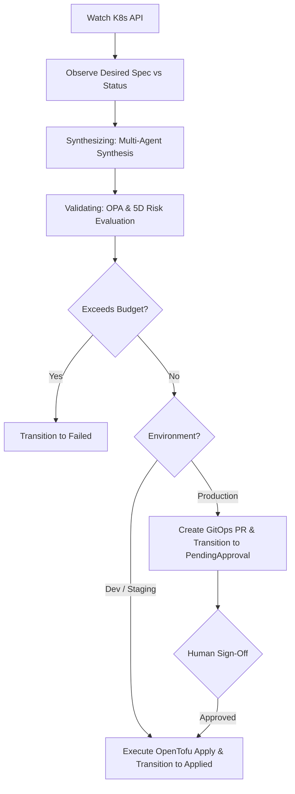

# ☸️ Phase 15: Kubernetes-Native Control Plane (CRD Operator & GitOps Controllers)

## 🎯 Overview

Phase 15 elevates the platform from an API/Web-driven application into an **Industrial-Grade Kubernetes Control Plane & Cloud Operating System**. It enables platform engineering teams to declare AI Terraform Agents, projects, workflows, and compliance policies as native Kubernetes Custom Resources, continuously reconciles cloud infrastructure, and integrates natively with enterprise GitOps engines like ArgoCD and Flux CD.

Core objectives:

- Kubernetes Custom Resource Definitions (CRDs) for Terraform Agents, Projects, Workflows, and Policies
- Declarative Infrastructure-as-Code via `kubectl apply -f agent.yaml`
- Asynchronous Operator Controller reconciliation loop with Kubernetes Condition lifecycle
- Continuous background Cloud Drift Watcher with automated self-healing
- Enterprise GitOps integration with ArgoCD (custom Lua health checks & ConfigMap patch)
- Flux CD notification webhook controller & commit digest synchronizer
- Production Helm 3 chart with Deployment, ServiceAccount, and least-privilege RBAC ClusterRoles
- Native REST API endpoints in dashboard for CRD export, manifest generation, and on-demand reconciliation

---

# 🏗️ Phase 15 Control Plane Architecture

---

# 📄 Custom Resource Definitions (`k8s/crds/`)

The platform defines 4 enterprise Kubernetes Custom Resources under the API group `platform.terraform-ai.io/v1alpha1`:

### 1. `TerraformAgent`
Manages the end-to-end lifecycle of an AI-driven infrastructure deployment.
- **Spec**:
  - `prompt`: Natural language infrastructure intent.
  - `engine`: `"opentofu"` or `"terraform"`.
  - `environment`: `"dev"`, `"staging"`, or `"production"`.
  - `governance`: Budget caps, compliance packs (`cis_aws_foundations`, `soc2_type2`, etc.), risk thresholds.
  - `gitops`: Target repository, target branch, auto-healing flag.
  - `stateBackend`: Remote state store config (S3, GCS, AzureRM).
- **Status**:
  - `phase`: `Pending` $\rightarrow$ `Synthesizing` $\rightarrow$ `Validating` $\rightarrow$ `PendingApproval` $\rightarrow$ `Applying` $\rightarrow$ `Applied` $\rightarrow$ `DriftDetected` $\rightarrow$ `Failed`.
  - `conditions`: Standard Kubernetes conditions (`Ready`, `Compliant`, `DriftFree`).
  - `riskScore`: Composite risk score.
  - `infracostMonthlyUSD`: Projected monthly dollar spend.
  - `activePR`: Active Pull Request URL.

### 2. `PlatformProject`
Cluster-scoped resource governing multi-tenant boundaries, budget caps, allowed cloud providers, and assigned namespaces.

### 3. `Workflow`
Namespaced resource exposing declarative DAG visual workflow execution within Kubernetes.

### 4. `Policy`
Namespaced resource enforcing OPA Rego guardrails, CIS compliance, and mandatory resource tagging standards.

---

# ⚙️ Operator Controller Engine (`k8s/operator/`)

The operator controller watches and reconciles Custom Resources using an event-driven loop:

- **`crd_schema.py`**: Pydantic models matching OpenAPI v3 schemas.
- **`status_manager.py`**: Transition manager updating Kubernetes condition objects with timezone-aware ISO timestamps.
- **`drift_watcher.py`**: Continuous drift detection comparing real cloud resources with desired HCL manifests.
- **`reconciler.py`**: Execution engine emitting standard Kubernetes Events (`Normal Synthesized`, `Normal PRCreated`, `Normal Applied`, `Warning ReconcileFailed`).

---

# 🔄 GitOps Engine Integration (`k8s/gitops/`)

### ArgoCD Custom Health Check (`argocd_plugin.py`)
Custom Lua health check script conforming to ArgoCD specification:
- `status.phase == "Applied"` $\rightarrow$ `Healthy`
- `status.phase in ["Synthesizing", "Validating", "Applying"]` $\rightarrow$ `Progressing`
- `status.phase == "PendingApproval"` $\rightarrow$ `Suspended`
- `status.phase in ["Failed", "DriftDetected"]` $\rightarrow$ `Degraded`

Generates ready-to-apply `argocd-cm` ConfigMap patch.

### Flux CD Controller (`flux_controller.py`)
Webhook receiver that handles notifications from Flux `GitRepository` controllers, extracts commit SHAs, and triggers targeted reconciliations.

---

# 📦 Helm 3 Chart (`k8s/helm/`)

Production Helm chart for deploying the operator onto any Kubernetes cluster (EKS, AKS, GKE, KinD, Minikube):
- `Chart.yaml`: Package metadata (`terraform-ai-operator`, version 1.0.0).
- `values.yaml`: Configurable replicas, resource limits, default engine, log level.
- `templates/deployment.yaml`: Deployment manifest with liveness/readiness probes.
- `templates/rbac.yaml`: Least-privilege `ClusterRole`, `ClusterRoleBinding`, and `ServiceAccount`.

---

# 🌐 REST API Endpoints

Integrated into the FastAPI dashboard (`app/dashboard.py`):
- `GET /api/k8s/operator/status`: Operator health, version, registered CRDs, and loop status.
- `GET /api/k8s/crds`: Returns all 4 CRD YAML definitions.
- `POST /api/k8s/manifest/generate`: Generates a validated `TerraformAgent` YAML manifest from parameters.
- `POST /api/k8s/reconcile`: Triggers on-demand reconciliation of a `TerraformAgent` custom resource.

---

# 🧪 Verification & Test Coverage

Automated test suite located at `scratch/test_phase15_k8s_control_plane.py`:
- `test_01_crd_yaml_files_exist_and_parse`: Validates all 4 CRD manifests.
- `test_02_terraform_agent_schema_validation`: Validates Pydantic schema constraints.
- `test_03_auxiliary_crd_schemas`: Validates PlatformProject, Workflow, Policy schemas.
- `test_04_reconciler_dev_environment_direct_apply`: Tests Dev direct apply & K8s events.
- `test_05_reconciler_production_gitops_pr_and_approval`: Tests Prod GitOps PR & approval.
- `test_06_reconciler_budget_exceeded_fails_gracefully`: Tests budget enforcement.
- `test_07_drift_watcher_insync_and_drift_detected`: Tests drift detection & auto-healing.
- `test_08_argocd_health_check_mapping`: Tests ArgoCD Lua health script states.
- `test_09_flux_controller_webhook_handling`: Tests Flux webhook callback parser.
- `test_10_api_k8s_operator_status`: Tests `/api/k8s/operator/status` HTTP 200.
- `test_11_api_k8s_crds`: Tests `/api/k8s/crds` HTTP 200.
- `test_12_api_k8s_manifest_generate`: Tests `/api/k8s/manifest/generate` HTTP 200.
- `test_13_api_k8s_reconcile`: Tests `/api/k8s/reconcile` HTTP 200.

**Results**: 13/13 passed (100% OK).

---

*Phase 15 - Kubernetes-Native Control Plane (CRD Operator & GitOps Controllers)*
